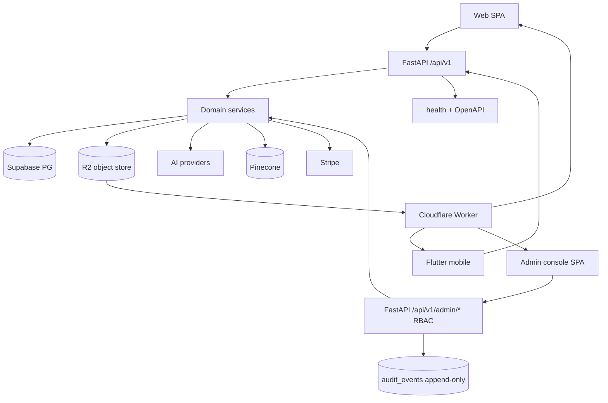

# Architecture

Last updated: 2026-08-08

FitCheck AI is a monorepo: React web + Flutter mobile clients call a FastAPI backend. An internal admin console (`admin/`, React 19 SPA) calls the same backend's `/api/v1/admin/*` surface with server-enforced RBAC. Supabase is the system of record for the DB (Postgres) + Auth; file storage is a private S3-compatible bucket (Railway Bucket → Cloudflare R2 since the 2026-08-05 egress RCA; R2 egress is $0). Images are served to clients either as short-lived presigned URLs (default) or as stable, edge-cached URLs through a Cloudflare Worker (`infra/images-worker/`, `IMAGE_SERVING_MODE=worker`) with `_thumb` siblings for list/grid tiles. AI runs behind backend provider abstractions. Optional vector retrieval uses Pinecone.

This file is the top-level map of domains and **allowed dependency edges**. Deeper runtime detail lives in `docs/BACKEND.md`, `docs/FRONTEND.md`, `docs/FLUTTER.md`, and `docs/references/`.

## System diagram

Single authoritative view (rendered on GitHub). Clients — web, mobile, and
the admin console — all consume image URLs served from R2 via the Cloudflare
Worker; the admin console calls the RBAC-guarded `/api/v1/admin/*` surface
and appends audit events (service-role only, append-only table).



Layer flow: clients → API → services → data/AI/storage; images served from R2 via the Cloudflare Worker.

## Repository domains

| Path | Role |
|------|------|
| `backend/` | API, business logic, AI orchestration, tests |
| `frontend/` | Web client (Vite + React + TypeScript) |
| `admin/` | Internal admin console (React 19 SPA; backend-enforced RBAC) |
| `flutter/` | Mobile client (GetX) |
| `docs/` | System of record for product/design/plans/quality |
| `scripts/` | Repo harness checks (docs structure, architecture) |

## Backend layers (enforced)

Dependency direction is **strictly forward**. Violations fail `scripts/check_architecture.py`.

```text
api/v1 (routes)  →  services  →  { models, db, core, agents }
                                      ↑
                    main.py wires routers + middleware only
```

| Layer | Path | May import | Must not import |
|-------|------|------------|-----------------|
| Routes | `app/api/v1/` | services, models, core, db, deps | nothing outside app patterns; keep thin |
| Services | `app/services/` | models, db, core, agents, other services | `app.api` |
| Agents | `app/agents/` | models, core, services (sparingly) | `app.api` |
| Models | `app/models/` | core (rarely), stdlib/pydantic | services, api, db clients as business logic |
| Core | `app/core/` | stdlib, settings libs | services, api |
| DB | `app/db/` | core | services, api |
| Utils | `app/utils/` | core, stdlib | `app.api`, `app.services` (infrastructure helpers only) |

### Backend principles

1. **Thin routes.** Handlers parse input, call services, map errors. Business logic stays in services.
2. **Parse at the boundary.** Request/response shapes are Pydantic models; do not YOLO unstructured dicts across layers.
3. **Provider abstraction.** AI vendor specifics live in `ai_provider_service` / config, not scattered in routes.
4. **Shared exceptions.** Raise types from `app.core.exceptions`; handlers in `main.py` format JSON errors with `correlation_id`.
5. **Hosted Supabase only.** No local Supabase runtime; migrations live under `backend/db/supabase/migrations/`.

### Key runtime flows (pointers)

Full step lists: `docs/BACKEND.md` (batch SSE extract, outfit gen, recommendations, rate limits).

- Batch wardrobe extract: `batch_processing.py` / `batch_extraction_service.py` (parallel extract, overlapped product gen, SSE).
- Auth: `docs/references/auth-flow.md`.
- Live OpenAPI: `http://localhost:8000/api/v1/docs` when backend is running.

## Frontend layers (enforced lightly)

```text
pages  →  components  →  { hooks, stores, api, lib, types }
api must not import pages or components
stores must not import pages
```

| Area | Path |
|------|------|
| Routes / guards | `frontend/src/App.tsx` |
| Pages | `frontend/src/pages/` |
| Feature UI | `frontend/src/components/` |
| Primitives | `frontend/src/components/ui/` |
| API client | `frontend/src/api/` (via `client.ts`) |
| Client state | `frontend/src/stores/` |
| Server state | TanStack Query |
| Utils | `frontend/src/lib/`, `hooks/` |

Details: `docs/FRONTEND.md`.

## Flutter layers (convention)

```text
features/*  →  core/*  →  external packages
app/ owns routes, bindings, theme
```

Details: `docs/FLUTTER.md`.

## Admin app layers (enforced by ESLint zones, not the Python checker)

```text
pages (route components, no logic)
  → features/<feature>/{components,hooks,api}   (feature logic lives here)
    → shared/{ui,lib,hooks,api,stores}          (cross-cutting)
      → openapi-fetch client                    (only import point of the network)
```

| Edge | Allowed | Enforced by |
|------|---------|-------------|
| `admin/` SPA → FastAPI `/api/v1/admin/*` | Yes (typed openapi-fetch; `contracts/openapi.json` codegen + drift check) | `npm run check:schema` |
| Admin routers → services (`admin_service`, `audit_service`, stripe, storage) → Supabase / Stripe | Yes (same backend layering as the public API; `scripts/check_architecture.py` covers `backend/app/**`) | `scripts/check_architecture.py` |
| `admin/src/features/*` cross-feature imports | **No** — a feature may import itself, `shared/`, `config/`, `app/`, `test/` only | ESLint `import-x/no-restricted-paths` (`admin/eslint.config.js`) |
| `admin/src/shared/*` → `features` or `app` | **No** | ESLint `import-x/no-restricted-paths` |
| Admin app importing backend code / hitting the DB directly | **No** — the app is a pure HTTP client of `/api/v1/admin/*` | Repo convention + codegen-only types |
| Backend `services`/`models`/`core` importing `app.api` | **No** (pre-existing rule; admin routers are `app.api.v1.admin`, so services must not import them) | `scripts/check_architecture.py` |

Notes:

- The Python checker does not scan `admin/`; admin layering is enforced by the app's ESLint flat config zones.
- RBAC lives backend-side (`backend/app/core/permissions.py`, deps `require_admin` / `require_permission` in `app/api/v1/deps.py`). The app's `shared/lib/permissions.ts` registry only shapes UI; `/api/v1/admin/me` is authoritative.
- Every admin mutation writes an append-only `audit_events` row (service-role only; migration 038).

## Cross-cutting concerns

| Concern | Where |
|---------|--------|
| Config / env | `backend/app/core/config.py`, `*.env.example` |
| AuthN | Supabase JWT; `core/security.py`, `api/v1/deps.py` |
| Logging | `core/logging_config.py`, correlation middleware |
| Errors | `core/exceptions.py` + handlers in `main.py` |
| Storage | `services/storage_service.py` + `services/object_storage.py` → R2 (S3-compatible; Railway Bucket supported); serving via `api/v1/images.py` (`serve_url`) — presigned or Worker mode; `infra/images-worker/` |
| Jobs / SSE | batch, photoshoot, social import job services |
| Security notes | `docs/SECURITY.md` |
| Reliability notes | `docs/RELIABILITY.md` |

## What agents must not do

- Import `app.api` from services, models, core, db, or agents.
- Import `app.services` from models, core, db, or utils.
- Import `app.api` or `app.services` from `app/utils/` (utils are pure infrastructure helpers: crypto, retry, image processing, parallel work — no reverse deps into domain layers).
- Put multi-step business workflows only in route handlers.
- Run Docker or local Supabase for development.
- Bypass service abstractions for one-off AI/vendor calls in routes.
- Leave architecture-breaking “temporary” shortcuts without an entry in `docs/exec-plans/tech-debt-tracker.md`.

## Verification

```bash
python scripts/check_architecture.py
python scripts/check_docs_structure.py
cd backend && pytest
cd frontend && npm run lint && npm run build
cd admin && npm run lint && npm run typecheck && npm test && npm run check:schema
```
