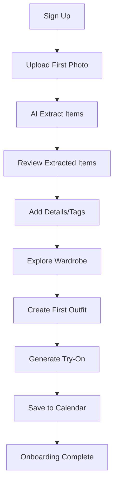
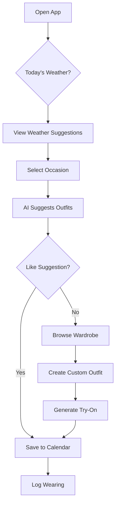

# Product Overview

## Problem Statement

Modern fashion consumers face several challenges in managing their wardrobe and making informed clothing decisions:

### Core Problems

1. **Wardrobe Blindness**
   - People own more clothes than they realize
   - Items get forgotten in the back of closets
   - Inefficient use of existing wardrobe

2. **Outfit Decision Fatigue**
   - Daily struggle of choosing what to wear
   - Uncertainty about which items work well together
   - Time wasted on trial and error

3. **Impulse Shopping**
   - Buying items that don't match existing wardrobe
   - Duplicate purchases of similar items
   - Financial waste on unworn clothing

4. **Lack of Visualization**
   - Can't see how items will look together before wearing
   - Difficulty planning outfits for specific occasions
   - No way to virtually try before buying

5. **Environmental Impact**
   - Fast fashion consumption leads to waste
   - Unworn items end up in landfills
   - Limited awareness of clothing sustainability

### Target Users

**Primary User Persona: Sarah, 28, Marketing Manager**

- Owns 200+ clothing items
- Spends 15+ minutes daily choosing outfits
- Makes 3-4 impulse purchases per month
- Wants to reduce shopping, increase utilization
- Mobile-first, uses social media daily

**Secondary Personas:**

1. **Minimalist Mike, 32**
   - Capsule wardrobe enthusiast
   - Values quality over quantity
   - Tracks cost-per-wear meticulously

2. **Fashion-forward Priya, 24**
   - Influencer/Content creator
   - Shares outfit inspiration
   - Wants to optimize content creation

3. **Practical Peter, 45**
   - Busy professional
   - Needs efficiency in dressing
   - Wants weather-appropriate suggestions

### Market Size

- Global fashion e-commerce: $820B (2025)
- Personal styling market: $15B growing 12% YoY
- Wardrobe management apps: 50M users, growing 35% YoY
- Target TAM: Consumers with 100+ clothing items (estimated 200M in US/Europe)

## Solution

FitCheck AI is a virtual closet with AI-powered outfit visualization that helps users:

### Core Value Propositions

1. **Digital Wardrobe Management**
   - Upload and catalog all owned items
   - AI-powered categorization and tagging
   - Complete visibility into wardrobe

2. **Intelligent Outfit Creation**
   - Visual mix-and-match interface
   - AI-generated outfit suggestions
   - Realistic try-on visualization

3. **Smart Analytics & Insights**
   - Usage tracking and cost-per-wear
   - Identify underutilized items
   - Wardrobe optimization recommendations

4. **Planning & Organization**
   - Calendar-based outfit planning
   - Weather integration
   - Occasion-based filtering

5. **Shopping Intelligence**
   - Gap analysis for missing pieces
   - Virtual try-before-buy
   - Sustainability scoring

### Competitive Advantages

| Feature | FitCheck AI | Competitors | Advantage |
|---------|-------------|-------------|-----------|
| **AI Try-On** | ✅ Realistic visualization | Some basic AR | Higher quality, multiple poses |
| **Item Extraction** | ✅ Automatic | Manual tagging | Time-saving automation |
| **Style Learning** | ✅ Personalized AI | Generic rules | Adapts to preferences |
| **Social Features** | ✅ Community + Stylists | Limited options | Hybrid model |
| **Price** | Competitive | $10-25/mo | Better value |
| **Mobile Experience** | ✅ Native-quality PWA | Often clunky | Superior UX |

## User Journey Flow

### Onboarding Flow

### Daily Usage Flow

## Business Model

### Revenue Streams

1. **Freemium Subscription**
   - **Free Tier:**
     - Up to 50 clothing items
     - 5 AI generations/month
     - Basic wardrobe management
   - **Pro Tier ($9.99/mo or $89.99/yr):**
     - Unlimited items
     - Unlimited AI generations
     - Advanced analytics
     - Priority support
     - Style recommendations

2. **Commission-Based Shopping**
   - 5% commission on purchases through affiliate links
   - Integration with major retailers
   - Similar item suggestions

3. **Stylist Services**
   - Connect users with professional stylists
   - 15% commission on stylist services
   - Premium styling packages

### Success Metrics

**Product Metrics:**
- User retention: 60% D1, 30% D30, 15% D90
- Items uploaded per user: 50+ (free), 150+ (pro)
- Daily active users: 30% of registered
- Outfits created per week: 5+

**Business Metrics:**
- Free to paid conversion: 8-12%
- ARPU (Average Revenue Per User): $4-6
- CAC (Customer Acquisition Cost): $8-12
- LTV (Lifetime Value): $120-180

## Key Differentiators

### 1. Best-in-Class AI

- **Item Extraction Agent:** Backend AI API (`POST /api/v1/ai/extract-items`) using server-side AI processing with multi-provider support (Gemini, OpenAI, or custom proxy).
- **Outfit Generation Agent:** Backend AI API (`POST /api/v1/ai/generate-outfit`) using server-side image generation.
- **Gemini Embeddings** (`gemini-embedding-001`) for semantic wardrobe analysis and matching (server-side).

### 2. User Experience

- Mobile-first responsive design
- Fast image uploads with server-side optimization
- Intuitive drag-and-drop interface
- Minimal cognitive load

### 3. Privacy & Security

- User data encryption at rest and in transit
- Secure authentication with Supabase Auth
- GDPR compliant
- Transparent data usage policies

### 4. Ecosystem Integration

- Calendar APIs (Google, Apple, Outlook)
- Weather APIs (OpenWeather)
- Social sharing (Instagram, TikTok)
- Retail partner integrations

## Launch Strategy

### Phase 1: MVP (Month 1-3)
- Core wardrobe management
- Basic outfit generation
- User authentication
- Mobile-responsive UI

### Phase 2: Enhanced Features (Month 4-6)
- Calendar integration
- Weather suggestions
- Advanced analytics
- Social sharing

### Phase 3: Expansion (Month 7-12)
- Shopping integrations
- Stylist marketplace
- Community features
- Gamification

### Phase 4: Scale (Month 13+)
- International expansion
- Retail partnerships
- Enterprise features (for brands)

## Success Criteria

### Technical KPIs
- **Performance:** < 2s image upload, < 5s outfit generation
- **Reliability:** 99.9% uptime
- **Scalability:** Support 100K+ concurrent users
- **Mobile:** 4.5+ App Store/Play Store rating

### Product KPIs
- **Engagement:** Users upload 50+ items within 7 days
- **Retention:** 30% monthly active user rate
- **Satisfaction:** 4.0+ NPS score
- **Growth:** 50K users in first 6 months

## Risks & Mitigation

### Technical Risks

| Risk | Impact | Probability | Mitigation |
|------|--------|-------------|------------|
| AI model limitations | High | Medium | Fallback options, continuous model improvement |
| Storage costs | Medium | High | Image compression, tiered storage |
| Performance bottlenecks | High | Medium | Caching, CDN, optimized queries |
| Data breaches | High | Low | Encryption, security audits |

### Business Risks

| Risk | Impact | Probability | Mitigation |
|------|--------|-------------|------------|
| Low conversion rates | High | Medium | Improve onboarding, feature value |
| Competitor entry | Medium | High | First-mover advantage, brand building |
| Privacy concerns | High | Low | Transparent policies, compliance |
| User fatigue | Medium | Medium | Continuous innovation, engagement |

## Future Roadmap

### Q1 2026: Foundation
- ✅ MVP launch
- ✅ Core features stable
- ✅ User feedback loop

### Q2 2026: Enhancement
- Calendar & weather integration
- Advanced AI recommendations
- Social features

### Q3 2026: Expansion
- Shopping partnerships
- Stylist marketplace
- Mobile apps (iOS/Android native)

### Q4 2026: Scale
- International markets
- Brand partnerships
- Advanced analytics

## Success Stories (Vision)

**Emma's Story:**
"I had 200+ clothes but only wore 20 of them. FitCheck AI helped me discover hidden gems and create 50+ new outfits from items I already owned. I saved $500/month on shopping!"

**Marcus's Story:**
"As a busy executive, I needed efficiency. FitCheck AI plans my entire week's outfits based on my calendar and weather. Saves me 2 hours every week."

**Priya's Story:**
"I create content for 50K followers. FitCheck AI helps me plan and visualize outfits before shooting. Increased engagement by 40%!"
