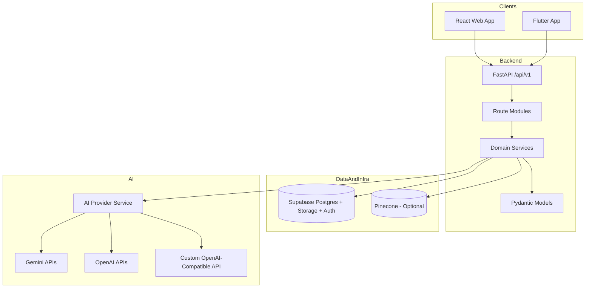

# System Architecture

Last updated: 2026-02-15

## Overview

FitCheck AI uses a monorepo architecture with a centralized FastAPI backend and multiple clients:
- Web client (`frontend/`): React + TypeScript
- Mobile client (`flutter/`): Flutter + GetX
- Backend (`backend/`): FastAPI service with modular route/service layers

Core platform services:
- Supabase: PostgreSQL + auth + object storage
- AI provider abstraction: Gemini, OpenAI, or custom OpenAI-compatible endpoints
- Optional vector layer: Pinecone

## Logical Architecture

## Backend Structure

Main entrypoint:
- `backend/app/main.py`

Primary layers:
- `backend/app/api/v1/`: HTTP routes and request orchestration
- `backend/app/services/`: business/domain logic and external integrations
- `backend/app/models/`: request/response/domain schemas
- `backend/app/core/`: config, middleware, security, exception handling
- `backend/app/db/`: Supabase connection helpers
- `backend/app/agents/`: AI extraction/generation agents

Route modules currently registered:
- `auth`, `users`, `items`, `outfits`, `shared_outfits`
- `recommendations`, `calendar`, `weather`, `gamification`
- `ai`, `ai_settings`, `batch_processing`
- `photoshoot`, `feedback`, `waitlist`, `demo`
- `subscription`, `referral`
- `social_import` (feature-flagged)

## Client Architecture

### Web (`frontend/`)

- App routing and guards in `frontend/src/App.tsx`
- Feature pages in `frontend/src/pages/`
- API wrappers in `frontend/src/api/`
- Global client state in `frontend/src/stores/`
- Reusable UI components in `frontend/src/components/`

### Mobile (`flutter/`)

- App bootstrapping in `flutter/lib/main.dart`
- GetX routes and bindings in `flutter/lib/app/`
- Feature modules in `flutter/lib/features/`
- Shared infrastructure in `flutter/lib/core/`

## Data Architecture

### Supabase

Supabase is the primary system of record for:
- user identity and profile-related entities
- wardrobe and outfit domain entities
- generation/recommendation metadata
- subscription/referral/support entities
- image asset metadata and storage paths

Migrations:
- SQL migrations in `backend/db/supabase/migrations/`
- baseline schema starts at `001_full_schema.sql`

### Optional Vector Layer

Pinecone is used for embedding-based similarity and recommendation paths when configured.

## AI Architecture

AI is backend-managed through provider abstractions:
- `ai_provider_service.py`
- `ai_service.py`
- `ai_settings_service.py`
- `ai_provider_health_service.py`

Provider classes supported by configuration:
- Gemini (`AI_GEMINI_*`)
- OpenAI (`AI_OPENAI_*`)
- Custom OpenAI-compatible endpoint (`AI_CUSTOM_*`)

## Runtime Flows

### 1. Item Extraction Flow

1. Client uploads image(s).
2. Backend `ai` endpoints call AI provider services.
3. Extracted structured metadata is returned to client.
4. Client confirms/edits metadata and persists item records.
5. Backend stores assets in Supabase storage and metadata in Postgres.

### 2. Outfit Generation Flow

1. Client submits selected items and generation options.
2. Backend calls AI provider for image generation.
3. Backend stores generated images and updates outfit records.
4. Client receives image URLs and render metadata.

### 3. Recommendations Flow

1. Client requests recommendations.
2. Backend aggregates wardrobe/profile context.
3. Optional embedding/similarity operations run via vector service.
4. Ranked recommendations are returned.

## Security & Reliability

Implemented controls include:
- JWT-based authentication checks
- CORS policy controls
- request correlation IDs and structured request logging
- centralized error handling
- schema readiness checks in health/startup paths
- provider health/circuit-breaker settings for AI providers

## Deployment & Environments

Local development standard:
- Non-Docker local run (`run-dev.sh` or manual backend/frontend commands)
- Hosted Supabase (no local Supabase runtime)

Container artifacts:
- Dockerfiles exist for deployment workflows, but local contributor workflow is non-Docker.

## Architectural Principles

- Keep route handlers thin; business logic belongs in services.
- Keep schema contracts in models.
- Keep provider-specific logic behind service abstractions.
- Keep client concerns separate from server business rules.
