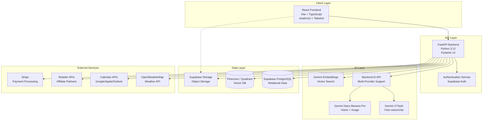
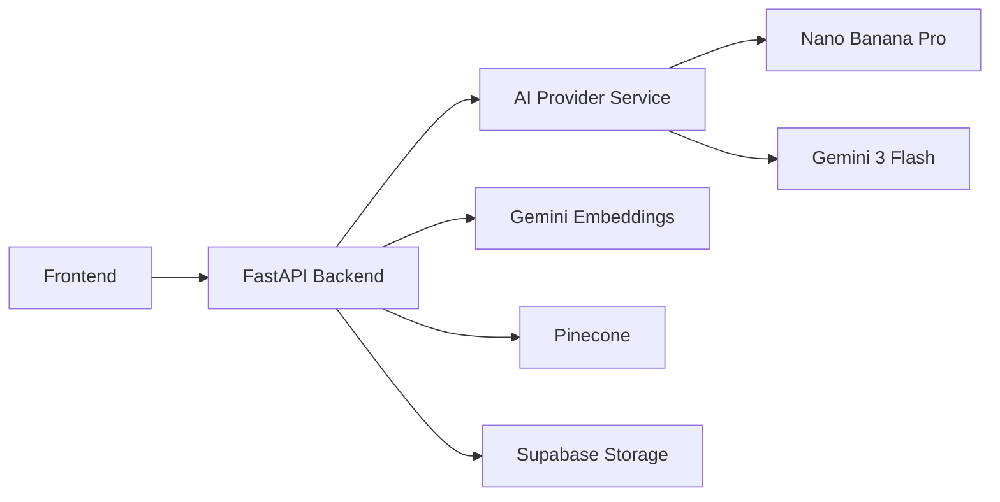
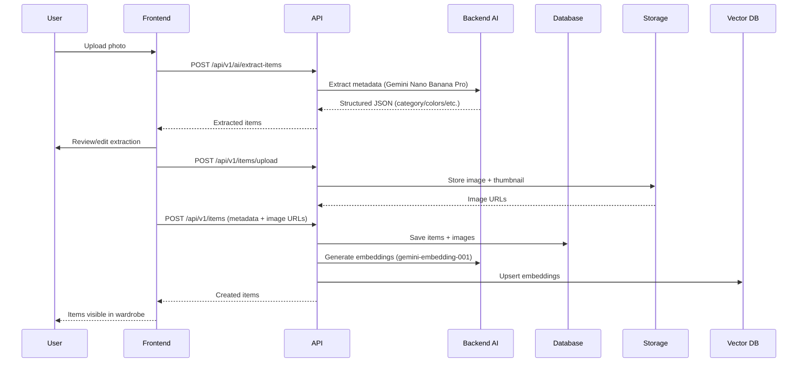
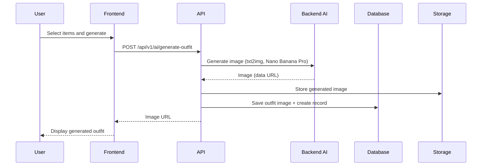

# System Architecture

## Overview

FitCheck AI uses a modern microservices-inspired architecture with a monolithic backend for simplicity. The system consists of a FastAPI backend, React frontend, Supabase for data storage, Pinecone for vector search, and a server-side AI architecture:

- **Server-side AI:** Backend AI API for item extraction + outfit image generation (multi-provider support)
- **Server-side Embeddings:** Gemini embeddings for similarity search and recommendations

## High-Level Architecture



## Component Breakdown

### 1. Frontend Layer

**Technology Stack:**
- Framework: React 18 + TypeScript
- Build Tool: Vite 5
- UI Library: shadcn/ui + Tailwind CSS
- State Management: TanStack Query (server state) + Zustand (client state)
- Routing: React Router v6
- Forms: React Hook Form + Zod validation
- HTTP Client: Axios

**Key Components:**
- **Authentication:** Login, signup, password reset
- **Wardrobe:** Item upload, browsing, filtering
- **Outfit Builder:** Item selection, AI generation
- **Planning:** Calendar integration, weather
- **Social:** Sharing, community feed
- **Profile:** User settings, preferences

**Deployment:**
- Hosted on Vercel or Netlify
- Static site generation (SSG) where possible
- CDN for asset delivery

---

### 2. Backend Layer

**Technology Stack:**
- Framework: FastAPI
- Language: Python 3.12
- Schema Validation: Pydantic v2
- AI SDK (server-side): google-genai (Gemini embeddings)
- Database ORM: Supabase Client (async)
- Vector Store: Pinecone SDK
- HTTP Client: httpx
- Task Queue: None (for MVP), Celery/RQ (future)

**Key Modules:**

**API Routes:**
```python
app/
├── api/
│   ├── v1/
│   │   ├── auth/
│   │   ├── users/
│   │   ├── items/
│   │   ├── outfits/
│   │   ├── recommendations/
│   │   ├── ai/
│   │   ├── ai_settings/
│   │   ├── calendar/
│   │   ├── weather/
│   │   └── gamification/
│   └── dependencies.py
├── core/
│   ├── config.py
│   ├── security.py
│   └── logging.py
├── services/
│   ├── ai_service.py
│   ├── storage_service.py
│   ├── vector_service.py
│   └── weather_service.py
├── models/
│   ├── item.py
│   ├── outfit.py
│   ├── user.py
│   └── recommendation.py
└── agents/  # (Future) server-side agents
```

**API Gateway Pattern:**
- Single FastAPI application
- Route prefix: `/api/v1`
- Rate limiting (future): Middleware
- Request validation: Pydantic models

---

### 3. AI Layer

**Technology Stack:**
- **Backend AI API:** Server-side AI processing with OpenAI-compatible format
- **Gemini Nano Banana Pro (gemini-3-pro-preview):** Vision chat for item extraction
- **Gemini Nano Banana Pro (gemini-3-pro-image-preview):** Image generation for outfit visualization
- **Gemini 3 Flash (gemini-3-flash-preview):** Fast multimodal analysis (auxiliary/fallback)
- **Gemini Embeddings (gemini-embedding-001):** Server-side embeddings for Pinecone similarity search

**Server-Side AI Architecture:**
- **Backend processes all AI requests** via `backend/app/services/ai_provider_service.py`
- **Multi-provider support:** Gemini, OpenAI, or custom proxy (configurable per user)
- **API keys encrypted** and stored in database

**Server-Side Agent Modules:**
- `backend/app/agents/item_extraction_agent.py`
- `backend/app/agents/image_generation_agent.py`



**Key Flows:**
- **Item Extraction:** Frontend → `POST /api/v1/ai/extract-items` → Backend AI → Response
- **Outfit Generation:** `POST /api/v1/ai/generate-outfit` → Backend AI → `POST /api/v1/outfits/{id}/images`

---

### 4. Data Layer

**Relational Database: Supabase (PostgreSQL)**


**Key Features:**
- PostgreSQL 15+ with JSONB support
- Row-level security (RLS) for multi-tenancy
- Real-time subscriptions (future)
- Automatic backups (Supabase feature)
- Connection pooling (PgBouncer)

**Vector Database: Pinecone**


**Schema:**
```python
{
    "id": "item_uuid",
    "values": [0.1, 0.2, 0.3, ...],  # 768-dim embedding
    "metadata": {
        "user_id": "user_uuid",
        "category": "tops",
        "colors": ["blue", "white"],
        "style": "casual"
    }
}
```

**Object Storage: Supabase Storage**


**Buckets:**
- `item-images`: Original and processed item photos
- `outfit-images`: AI-generated outfit images
- `user-avatars`: User profile pictures
- `temp-uploads`: Temporary uploads during processing

**Features:**
- CDN delivery (Supabase CDN)
- Image transformations (resize, crop, format)
- Expiring signed URLs
- Public/private buckets

---

### 5. External Services Integration

**Weather: OpenWeatherMap**
- Current weather API
- 7-day forecast API
- Caching: 15 minutes
- Fallback: Previous cached data

**Calendar: Google, Apple, Outlook**
- OAuth2 authentication
- Read-only access
- Webhooks for real-time sync (future)

**Shopping: Retailer APIs**
- Product search APIs
- Price tracking (scraping/APIs)
- Affiliate link generation

**Payment: Stripe**
- Stylist session payments
- Subscription payments
- Webhooks for payment confirmation

**Email: Resend/SendGrid**
- Transactional emails (signup, password reset)
- Notifications (price alerts, streak reminders)

---

## Data Flow

### Item Upload Flow



### Outfit Generation Flow



### Recommendation Flow


---

## Security Architecture

### Authentication & Authorization


**Implementation:**
- Supabase Auth for user authentication
- JWT tokens signed by Supabase
- Token verification in API middleware
- Role-based access control (RBAC) in future

### Data Security

- **Encryption at Rest:** Supabase encrypts all data
- **Encryption in Transit:** HTTPS/TLS 1.3
- **Input Validation:** Pydantic models
- **SQL Injection Prevention:** Parameterized queries
- **XSS Prevention:** React's built-in escaping
- **CSRF Protection:** SameSite cookies, CSRF tokens
- **Row-Level Security:** Supabase RLS for user data isolation

### API Security

- **Rate Limiting:** Middleware (future)
- **Request Size Limits:** 10MB for uploads
- **CORS:** Configured for specific origins
- **API Keys:** For external services
- **Secrets Management:** Environment variables

---

## Scalability Considerations

### Current Design (MVP)

**Capacity:**
- Concurrent users: 1,000
- Items stored: 100,000
- Outfits generated: 10,000/day
- Database connections: 20

**Bottlenecks:**
- AI generation: ~30 seconds per request (async processing)
- Vector search: Pinecone scales automatically
- Storage: Supabase storage has CDN

### Future Scaling

**Horizontal Scaling (Phase 2):**
- Load balancer (Nginx/Caddy)
- Multiple API instances (Docker)
- Database read replicas
- Caching layer (Redis)
- Message queue (Celery/RQ)

**Optimizations:**
- CDN for static assets
- Image pre-processing queues
- Batch AI generation
- Connection pooling
- Query optimization

---

## Deployment Architecture

### Development


### Production (Railway)


**Services:**
- **Backend:** Railway (Docker container)
- **Frontend:** Vercel (static deployment)
- **Database:** Supabase (managed PostgreSQL)
- **Storage:** Supabase Storage
- **AI:** Google Cloud AI (Gemini)
- **Vector DB:** Pinecone (managed)
- **CDN:** Cloudflare (Railway integration)

**CI/CD Pipeline:**
```yaml
# GitHub Actions
1. Push to main branch
2. Run tests (pytest)
3. Build Docker image
4. Push to Railway
5. Run migrations
6. Health check
7. Deploy to production
```

---

## Monitoring & Logging

### Structured Logging

```python
import logging
import json

class JSONFormatter(logging.Formatter):
    def format(self, record):
        log_data = {
            "timestamp": self.formatTime(record),
            "level": record.levelname,
            "message": record.getMessage(),
            "service": "fitcheck-ai",
            "request_id": getattr(record, "request_id", None),
        }
        return json.dumps(log_data)
```

**Log Levels:**
- INFO: Normal operations
- WARNING: Potential issues
- ERROR: Errors that don't stop service
- CRITICAL: Service-impacting errors

**Log Destinations:**
- Console (development)
- File (production): `/var/log/fitcheck/`
- Future: Datadog, New Relic

### Health Checks

```python
@app.get("/health")
async def health_check():
    checks = {
        "database": await check_database(),
        "ai_service": await check_ai_service(),
        "vector_db": await check_vector_db(),
        "storage": await check_storage(),
    }

    status = "healthy" if all(checks.values()) else "unhealthy"
    return {"status": status, "checks": checks}
```

### Metrics (Future)

- API response times
- Error rates
- User growth
- AI generation success rate
- Database query performance

---

## Disaster Recovery

### Backup Strategy

**Database:**
- Supabase automatic backups (daily)
- Point-in-time recovery (7 days)
- Manual weekly exports to external storage

**Storage:**
- Supabase storage replication
- Cross-region backup (future)

**Code:**
- GitHub (version control)
- CI/CD preserves deployment history

### Recovery Procedures

1. **Database Recovery:**
   - Use Supabase dashboard or API
   - Restore from backup
   - Verify data integrity
   - Update applications

2. **Service Recovery:**
   - Deploy previous version
   - Check health endpoint
   - Monitor logs

---

## Technology Justifications

| Technology | Reason |
|------------|--------|
| **FastAPI** | Fast, modern, async support, automatic OpenAPI docs |
| **Supabase** | PostgreSQL, auth, storage in one service, great DX |
| **Pinecone** | Managed vector DB, excellent for similarity search |
| **Backend AI API** | Server-side AI processing with multi-provider support |
| **Gemini Nano Banana Pro** | Best-in-class vision + image generation |
| **Gemini Embeddings** | 768-dim embeddings for similarity search |
| **React + TypeScript** | Industry standard, great ecosystem |
| **shadcn/ui** | Beautiful, accessible, customizable |
| **Vite** | Fast development, optimized production builds |
| **Railway** | Simple deployment, auto-scaling, good pricing |
| **GitHub Actions** | Free CI/CD, integrates with GitHub |

---

## Future Enhancements

### Phase 2 (6 months)
- Redis caching layer
- Celery task queue
- API rate limiting
- WebSocket support (real-time features)
- Multi-region deployment

### Phase 3 (12 months)
- Microservices architecture
- GraphQL API
- Advanced monitoring (Datadog)
- Automated testing at scale
- Feature flags

### Phase 4 (18+ months)
- Edge computing
- Custom ML models
- Advanced recommendation algorithms
- Multi-tenant SaaS
- White-label solution
