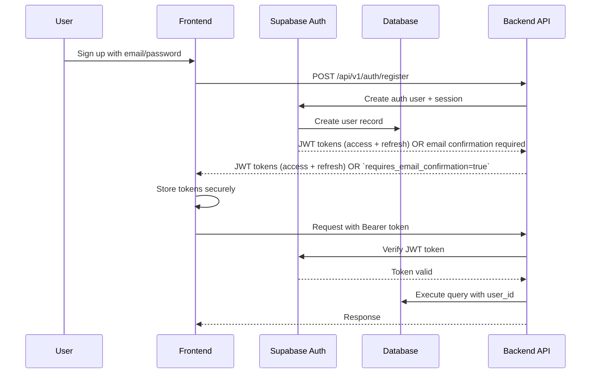

# Authentication & Authorization

## Overview

FitCheck AI uses Supabase Auth for user authentication (JWT access + refresh tokens). This document details the authentication flow, token management, and authorization patterns.

## Architecture



---

## Authentication Flow

### 1. Registration (Signup)

**Frontend (React):**

```typescript
const handleSignup = async (email: string, password: string, fullName: string) => {
  // Register in FitCheck (backend uses Supabase Auth server-side)
  const { data } = await apiClient.post('/api/v1/auth/register', {
    email,
    password,
    full_name: fullName,
  });

  // Store tokens
  localStorage.setItem('access_token', data.data.access_token);
  localStorage.setItem('refresh_token', data.data.refresh_token);
};
```

**Backend (FastAPI):**

```python
from supabase import create_client, Client

supabase: Client = create_client(
    supabase_url=os.getenv("SUPABASE_URL"),
    supabase_key=os.getenv("SUPABASE_PUBLISHABLE_KEY")
)

@router.post("/auth/register")
async def register_user(user: UserCreate):
    # Validate password strength
    if not is_password_strong(user.password):
        raise HTTPException(400, "Password too weak")

    # Create user in Supabase
    auth_response = supabase.auth.sign_up({
        "email": user.email,
        "password": user.password,
        "options": {
            "data": {
                "full_name": user.full_name,
            }
        }
    })

    if auth_response.user is None:
        raise HTTPException(400, "Registration failed")

    # Create additional user data in database
    await create_user_profile(auth_response.user.id, user)

    return {
        "user": auth_response.user,
        "access_token": auth_response.session.access_token,
        "refresh_token": auth_response.session.refresh_token,
        "requires_email_confirmation": auth_response.session is None
    }
```

**Password Validation:**

```python
import re

def is_password_strong(password: str) -> bool:
    """
    Password must be at least 8 characters and contain:
    - At least one uppercase letter
    - At least one lowercase letter
    - At least one number
    - At least one special character
    """
    if len(password) < 8:
        return False

    # Check for uppercase
    if not re.search(r'[A-Z]', password):
        return False

    # Check for lowercase
    if not re.search(r'[a-z]', password):
        return False

    # Check for numbers
    if not re.search(r'\d', password):
        return False

    # Check for special characters
    if not re.search(r'[!@#$%^&*(),.?":{}|<>]', password):
        return False

    return True
```

---

### 2. Login

**Frontend:**

```typescript
const handleLogin = async (email: string, password: string) => {
  const { data } = await apiClient.post('/api/v1/auth/login', { email, password });

  // Tokens are stored client-side (access + refresh)
  localStorage.setItem('access_token', data.data.access_token);
  localStorage.setItem('refresh_token', data.data.refresh_token);

  // Redirect to dashboard
  navigate('/dashboard');
};
```

**Backend:**

```python
@router.post("/auth/login")
async def login_user(credentials: LoginRequest):
    # Authenticate with Supabase
    auth_response = supabase.auth.sign_in_with_password({
        "email": credentials.email,
        "password": credentials.password
    })

    if auth_response.user is None:
        raise HTTPException(401, "Invalid credentials")

    # Update last_login_at
    await update_last_login(auth_response.user.id)

    return {
        "access_token": auth_response.session.access_token,
        "refresh_token": auth_response.session.refresh_token,
        "user": {
            "id": auth_response.user.id,
            "email": auth_response.user.email,
            "full_name": auth_response.user.user_metadata.get("full_name"),
            "avatar_url": auth_response.user.user_metadata.get("avatar_url")
        }
    }
```

---

### 3. Token Verification (Middleware)

**FastAPI Dependency:**

```python
from fastapi import Depends, HTTPException, status
from fastapi.security import HTTPBearer, HTTPAuthorizationCredentials
import jwt
from datetime import datetime

security = HTTPBearer()

async def verify_token(
    credentials: HTTPAuthorizationCredentials = Depends(security)
) -> dict:
    """
    Verify JWT token and extract user claims.
    """
    token = credentials.credentials

    try:
        # Verify with Supabase JWT secret
        decoded = jwt.decode(
            token,
            os.getenv("SUPABASE_JWT_SECRET"),
            algorithms=["HS256"],
            audience="authenticated"
        )

        # Check expiration
        if decoded.get("exp", 0) < datetime.now().timestamp():
            raise HTTPException(
                status_code=401,
                detail="Token expired"
            )

        return decoded

    except jwt.ExpiredSignatureError:
        raise HTTPException(
            status_code=401,
            detail="Token expired"
        )
    except jwt.InvalidTokenError:
        raise HTTPException(
            status_code=401,
            detail="Invalid token"
        )

# Usage in routes
@router.get("/items")
async def get_items(
    user_claims: dict = Depends(verify_token)
):
    user_id = user_claims.get("sub")
    # Fetch items for user_id
    pass
```

---

### 4. Token Refresh

**Frontend:**

```typescript
const refreshToken = async () => {
  const { data, error } = await supabase.auth.refreshSession();

  if (error) {
    // Refresh failed, redirect to login
    navigate('/login');
    return;
  }

  // Update stored tokens
  localStorage.setItem('access_token', data.session.access_token);
  localStorage.setItem('refresh_token', data.session.refresh_token);
};

// Set up automatic refresh
supabase.auth.onAuthStateChange((event, session) => {
  if (event === 'TOKEN_REFRESHED') {
    localStorage.setItem('access_token', session.access_token);
    localStorage.setItem('refresh_token', session.refresh_token);
  }
});
```

**Backend:**

```python
@router.post("/auth/refresh")
async def refresh_token(refresh_request: RefreshTokenRequest):
    # Use refresh token to get new access token
    auth_response = supabase.auth.refresh_session({
        "refresh_token": refresh_request.refresh_token
    })

    if auth_response.session is None:
        raise HTTPException(401, "Invalid refresh token")

    return {
        "access_token": auth_response.session.access_token,
        "refresh_token": auth_response.session.refresh_token
    }
```

---

### 5. Logout

**Frontend:**

```typescript
const handleLogout = async () => {
  await supabase.auth.signOut();

  // Clear local storage
  localStorage.removeItem('access_token');
  localStorage.removeItem('refresh_token');

  // Redirect to login
  navigate('/login');
};
```

**Backend:**

```python
@router.post("/auth/logout")
async def logout_user():
    # In stateless JWT, we just remove the token from client
    # With Supabase, we can invalidate the session
    supabase.auth.signOut()
    return {"message": "Logged out successfully"}
```

---

## Authorization

### Row-Level Security (RLS)

Supabase RLS ensures users can only access their own data.

**Enable RLS:**

```sql
-- Enable RLS on items table
ALTER TABLE items ENABLE ROW LEVEL SECURITY;

-- Create policy: Users can read their own items
CREATE POLICY "Users can read own items"
ON items
FOR SELECT
USING (auth.uid()::text = user_id::text);

-- Create policy: Users can insert their own items
CREATE POLICY "Users can insert own items"
ON items
FOR INSERT
WITH CHECK (auth.uid()::text = user_id::text);

-- Create policy: Users can update their own items
CREATE POLICY "Users can update own items"
ON items
FOR UPDATE
USING (auth.uid()::text = user_id::text);

-- Create policy: Users can delete their own items
CREATE POLICY "Users can delete own items"
ON items
FOR DELETE
USING (auth.uid()::text = user_id::text);
```

---

### Role-Based Access Control (RBAC)

For future use with admin roles.

**User Roles Table:**

```sql
CREATE TABLE user_roles (
    user_id UUID REFERENCES users(id) ON DELETE CASCADE,
    role VARCHAR(50) NOT NULL,
    PRIMARY KEY (user_id, role)
);

-- Roles: 'user', 'admin', 'moderator', 'stylist'
```

**Role Check Middleware:**

```python
async def require_role(role: str):
    def role_checker(
        user_claims: dict = Depends(verify_token)
    ) -> dict:
        # Fetch user roles from database
        user_roles = await get_user_roles(user_claims.get("sub"))

        if role not in user_roles:
            raise HTTPException(
                status_code=403,
                detail=f"Requires {role} role"
            )

        return user_claims

    return role_checker

# Usage
@router.get("/admin/dashboard")
async def admin_dashboard(
    user_claims: dict = Depends(require_role("admin"))
):
    # Only accessible by admins
    pass
```

---

## Password Reset

### Request Password Reset

**Frontend:**

```typescript
// See: frontend/src/pages/auth/ForgotPasswordPage.tsx
await apiClient.post('/api/v1/auth/reset-password', { email });
```

**Backend:**

```python
@router.post("/auth/reset-password")
async def reset_password_request(request: PasswordResetRequest):
    # Trigger Supabase to send reset email (redirects back to the frontend)
    supabase.auth.reset_password_for_email(
        request.email,
        {"redirectTo": os.getenv("FRONTEND_URL") + "/auth/reset-password"}
    )

    return {"message": "Password reset email sent"}
```

---

### Confirm Password Reset

**Frontend:**

```typescript
// See: frontend/src/pages/auth/ResetPasswordPage.tsx
// Supabase redirects to /auth/reset-password with:
//   #access_token=...&refresh_token=...&type=recovery
//
// The frontend posts those tokens to the backend to set a temporary session
// and update the password server-side.
await apiClient.post('/api/v1/auth/confirm-reset-password', {
  access_token,
  refresh_token,
  new_password,
});
```

**Backend:**

```python
@router.post("/auth/confirm-reset-password")
async def confirm_reset_password(
    request: ConfirmResetPasswordRequest
):
    supabase.auth.set_session(request.access_token, request.refresh_token)
    supabase.auth.update_user({"password": request.new_password})

    return {"message": "Password reset successfully"}
```

---

## Security Best Practices

### 1. Password Security

- **Minimum length:** 8 characters
- **Complexity:** Upper, lower, number, special char
- **Hashing:** Supabase uses bcrypt
- **No storage in plaintext**

### 2. Token Security

- **HTTPS only:** Tokens only transmitted over HTTPS
- **Secure storage:** Use httpOnly cookies or secure storage
- **Short expiration:** Access tokens expire in 1 hour
- **Refresh tokens:** Longer expiration (7 days)
- **Token revocation:** Invalidate on logout

### 3. CSRF Protection

- **SameSite cookies:** Prevent cross-site request forgery
- **CSRF tokens:** Validate for state-changing operations
- **Origin validation:** Check CORS headers

### 4. SQL Injection Prevention

- **Parameterized queries:** Supabase client prevents SQLi
- **Input validation:** Pydantic models validate all inputs
- **Allowlist:** Only allow known table/column names

### 5. XSS Prevention

- **Content Security Policy (CSP):** Restrict script sources
- **Input sanitization:** Escape all user input
- **React escaping:** Built-in XSS protection

---

## Error Handling

### Authentication Errors

```python
class AuthError(HTTPException):
    """Custom authentication error"""

    def __init__(self, detail: str, code: str):
        super().__init__(
            status_code=401,
            detail={
                "error": detail,
                "code": code
            }
        )

# Usage
raise AuthError("Invalid credentials", "INVALID_CREDENTIALS")
raise AuthError("Token expired", "TOKEN_EXPIRED")
raise AuthError("Access denied", "ACCESS_DENIED")
```

---

## Frontend Auth State Management

**Zustand Store:**

```typescript
// stores/authStore.ts
import { create } from 'zustand';
import { supabase } from '@/lib/supabase';

interface AuthState {
  user: User | null;
  accessToken: string | null;
  isAuthenticated: boolean;
  login: (email: string, password: string) => Promise<void>;
  logout: () => Promise<void>;
  refresh: () => Promise<void>;
}

export const useAuthStore = create<AuthState>((set) => ({
  user: null,
  accessToken: localStorage.getItem('access_token'),
  isAuthenticated: !!localStorage.getItem('access_token'),

  login: async (email, password) => {
    const { data, error } = await supabase.auth.signInWithPassword({
      email,
      password,
    });

    if (error) throw error;

    localStorage.setItem('access_token', data.session.access_token);
    localStorage.setItem('refresh_token', data.session.refresh_token);

    set({
      user: data.user,
      accessToken: data.session.access_token,
      isAuthenticated: true,
    });
  },

  logout: async () => {
    await supabase.auth.signOut();
    localStorage.removeItem('access_token');
    localStorage.removeItem('refresh_token');
    set({ user: null, accessToken: null, isAuthenticated: false });
  },

  refresh: async () => {
    const { data, error } = await supabase.auth.refreshSession();
    if (error) throw error;

    localStorage.setItem('access_token', data.session.access_token);
    localStorage.setItem('refresh_token', data.session.refresh_token);

    set({ accessToken: data.session.access_token });
  },
}));
```

---

## Testing Authentication

### Unit Tests

```python
import pytest
from fastapi.testclient import TestClient
from app.main import app

client = TestClient(app)

def test_register_user():
    response = client.post(
        "/api/v1/auth/register",
        json={
            "email": "test@example.com",
            "password": "SecurePass123!",
            "full_name": "Test User"
        }
    )
    assert response.status_code == 201
    assert "access_token" in response.json()["data"]

def test_login_user():
    response = client.post(
        "/api/v1/auth/login",
        json={
            "email": "test@example.com",
            "password": "SecurePass123!"
        }
    )
    assert response.status_code == 200
    assert "access_token" in response.json()["data"]

def test_protected_endpoint_without_token():
    response = client.get("/api/v1/items")
    assert response.status_code == 401

def test_protected_endpoint_with_token():
    # First login to get token
    login_response = client.post(
        "/api/v1/auth/login",
        json={
            "email": "test@example.com",
            "password": "SecurePass123!"
        }
    )
    token = login_response.json()["data"]["access_token"]

    # Access protected endpoint
    response = client.get(
        "/api/v1/items",
        headers={"Authorization": f"Bearer {token}"}
    )
    assert response.status_code == 200
```

---

## Summary

| Feature | Implementation |
|----------|----------------|
| **Authentication Provider** | Supabase Auth |
| **Token Type** | JWT (HS256) |
| **Access Token Expiry** | 1 hour |
| **Refresh Token Expiry** | 7 days |
| **Password Requirements** | 8+ chars, mixed case, number, special |
| **Data Isolation** | Row-Level Security (RLS) |
| **Role-Based Access** | Planned for Phase 2 |
| **Password Reset** | Email-based flow |
| **Token Storage** | httpOnly cookies (future), local storage (current) |
| **CSRF Protection** | SameSite cookies, CSRF tokens |
| **Session Management** | Stateless JWT |
