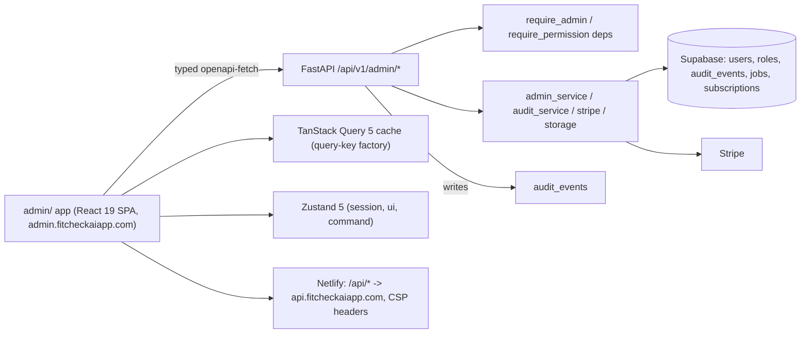

# Admin panel — enterprise console (backend contract + React 19 SPA)

Status: implemented (code + tests landed); follow-ups tracked as debt
Started: 2026-08-06
Owner: orchestrator (backend contract + admin app + hardening waves)

## Goal

Ship an internal admin console for the FitCheck AI founder and non-technical
ops/content/support staff: a **separate `admin/` SPA** (React 19 + Vite 7 +
Tailwind 4) deployed to `admin.fitcheckaiapp.com`, talking to the same FastAPI
backend through a new `/api/v1/admin/*` API. All authorization is
**backend-enforced** (server-side RBAC, no trust in UI gating). The admin app
replaces the legacy blog admin that used to live in `frontend/`
(`/admin/blog/*` routes removed from the main web app; blog editing is now a
content feature of the admin app).

## Non-goals

- Granular field-level permissions (role-level only, per spec §12).
- Flutter admin client.
- Multi-tenant organization support.
- Realtime dashboards (poll-based v1).
- Any change to public client behavior — the admin surface is additive.

## Acceptance criteria

- [x] Backend: migrations 037 (roles/quota override) + 038 (audit_events) idempotent, applied to hosted Supabase.
- [x] Backend: `GET /api/v1/admin/me` returns `{ user, role, permissions[] }`; every admin endpoint behind `require_admin` / `require_permission`.
- [x] Backend: every admin mutation writes an `audit_events` row (actor, action, entity, payload, ip, user-agent).
- [x] Backend: RBAC unit/route tests (`tests/api/test_admin_*.py` + `tests/integration/test_admin/*.py`, 172 tests) cover 403 authz, CRUD, audit, suspend, refund.
- [x] Admin app: skeleton (M2) — login + `/admin/me` bootstrap, guards, layout, theme, i18n, toasts, error boundaries.
- [x] Admin app: data infra (M3) — openapi-typescript codegen from `contracts/openapi.json`, drift check, typed client, query-key factory, DataTable + URL-synced table state.
- [x] Admin app: feature modules (M4) — users, dashboard, subscriptions + IAP, quotas, content (blog port), promo, feedback, ops/storage, audit explorer, search palette, settings.
- [x] Admin app: `npm run lint` / `typecheck` / `test` / `build` green; 28 Vitest files / 215 tests.
- [x] Docs + repo integration: exec plan, `admin/CLAUDE.md`, root map row, `ARCHITECTURE.md` admin domain, `admin/README.md`, `docs/BACKEND.md` admin section, quality + debt entries.
- [x] Playwright e2e journeys — specs landed (6 files, 8 journeys); CI wiring + token-refresh end-to-end verification pending (see §Deferred debt).
- [ ] `scripts/check_all.sh` green after this wave (docs/architecture/theme/ios checks; pytest + frontend + flutter when toolchains present).

## Context / links

- Architecture spec (source of truth): `admin/README.md` (the standalone `2026-08-06-fitcheckai-admin-panel-enterprise-architecture-spec.md` file does not exist in the repo)
- Related code:
  - Backend: `backend/app/core/permissions.py` (roles → permissions), `backend/app/api/v1/deps.py` (`require_admin` / `require_permission`), `backend/app/api/v1/admin/*` (13 routers), `backend/app/services/admin_service.py`, `backend/app/services/audit_service.py`, `backend/app/models/admin.py`
  - Migrations: `backend/db/supabase/migrations/037_admin_roles.sql`, `038_audit_events.sql`
  - App: `admin/` (contracts, scripts, src)
- Related docs: `ARCHITECTURE.md`, `admin/README.md`, `docs/BACKEND.md`, `docs/QUALITY_SCORE.md`, `docs/exec-plans/tech-debt-tracker.md`

## Decisions

| Date | Decision | Why |
|------|----------|-----|
| 2026-08-06 | Separate `admin/` app in the monorepo (not routes in `frontend/`) | Different stack line (React 19/Vite 7/Tailwind 4 vs the public app's React 18/Vite 5/Tailwind 3), different audience, isolated blast radius; only visual tokens and API contracts stay in sync (via `DESIGN.md` + OpenAPI codegen, not shared code) |
| 2026-08-06 | Server-enforced RBAC as the only trust boundary | UI gating is cosmetic; `require_admin`/`require_permission` deps on every endpoint; `/admin/me` drives what the UI shows |
| 2026-08-06 | OpenAPI codegen contract (`contracts/openapi.json` → `src/shared/api/schema.d.ts`) + CI drift check | Backend can evolve without type drift; mismatch fails CI (`npm run check:schema`) |
| 2026-08-06 | Legacy blog admin folds into the admin app | Single admin surface; `frontend/` `/admin/blog/*` routes removed; backend `blog.py`'s `verify_admin` stays as a thin wrapper over the shared role resolution for the public blog's admin-write endpoints |
| 2026-08-06 | `audit_events` append-only, service-role only, best-effort writes | Never let the audit trail take down the admin action it documents; RLS policy grants only the service role |
| 2026-08-06 | Storybook skipped | MSW + component tests cover review needs; revisit if the design system outgrows tests (spec §11) |

## Architecture summary



Layers inside the app (one-way): `pages → features/<feature>/{components,hooks,api} → shared/{ui,lib,hooks,api,stores} → openapi-fetch client`. Feature isolation enforced by ESLint `import-x/no-restricted-paths` (zones per feature); `shared` never imports from `features`/`app`.

## RBAC role → permission matrix

Source of truth: `backend/app/core/permissions.py` (mirrored for UI shaping only in `admin/src/shared/lib/permissions.ts`). `*` = grant-all (super_admin, admin).

| Permission | super_admin | admin | ops | support | content_editor |
|------------|:-----------:|:-----:|:---:|:-------:|:--------------:|
| `*` (all) | x | x | | | |
| `dashboards.read` | x | x | x | x | x |
| `users.read` | x | x | x | x | |
| `users.write` | x | x | x | x | |
| `subscriptions.read` | x | x | x | x | |
| `subscriptions.refund` | x | x | x | | |
| `iap.read` | x | x | x | x | |
| `quotas.read` | x | x | | x | |
| `ops.read` | x | x | x | | |
| `storage.cleanup` | x | x | x | | |
| `audit.read` | x | x | x | x | |
| `content.read` | x | x | | | x |
| `content.write` | x | x | | | x |
| `promo.read` | x | x | | | x |
| `feedback.read` | x | x | | x | |
| `feedback.write` | x | x | | x | |
| `search` | x | x | x | x | x |

Legacy fallback (`get_user_role`): explicit `role` in the admin set wins; otherwise `is_admin = True` OR an `@fitcheckaiapp.com` email resolves to `admin` (preserves pre-RBAC `blog.py` semantics). Everything else is `user` (403 on admin endpoints).

## Backend endpoint inventory (`/api/v1/admin`, mounted in `app/main.py`)

| Path | Permission | Purpose |
|------|-----------|---------|
| `GET /me` | `require_admin` | Session bootstrap: profile + role + granted permissions |
| `GET /users` | `users.read` | Paginated list: search (q), status/role/plan filters, sort |
| `GET /users/{user_id}` | `users.read` | Full detail: profile + subscription + usage + counts + recent jobs |
| `PATCH /users/{user_id}` | `users.write` | Role / is_admin / is_active edits; self-demotion + last-admin guards; audit per changed field |
| `GET /users/{user_id}/activity` | `users.read` | Recent audit events + jobs for one user (25 each) |
| `GET /subscriptions` | `subscriptions.read` | Paginated subscriptions (plan/status filters, sort) |
| `GET /subscriptions/user/{user_id}` | `subscriptions.read` | Full subscription detail incl. provider identifiers + usage |
| `POST /subscriptions/user/{user_id}/refund` | `subscriptions.refund` | Full refund of latest Stripe charge (store-billed rows rejected); audit `subscription.refunded` |
| `GET /iap/transactions` | `iap.read` | Paginated store transactions (apple/google) |
| `GET /iap/transactions/{txn_id}` | `iap.read` | IAP detail by any provider identifier |
| `POST /iap/transactions/{txn_id}/mark-refunded` | `require_admin` | Record refunded state (webhooks stay authoritative); audit `iap.refund_marked` |
| `GET /quotas` | `quotas.read` | Today's per-user AI usage (daily counters) |
| `PATCH /users/{user_id}/quota-override` | `require_admin` | Set/clear `users.custom_daily_quota` (null = plan default); audit `quota.override` |
| `GET /dashboards/overview` | `dashboards.read` | Signups / active / paid / jobs aggregates |
| `GET /dashboards/top-users` | `dashboards.read` | Top-10 users by outfits, items, referrals |
| `GET /dashboards/referrals` | `dashboards.read` | Referral totals: codes, redemptions, credits |
| `GET /promo-codes` | `promo.read` | Paginated promo codes with redemption counts |
| `POST /promo-codes` | `content.write` | Create code (format + duplicate validation); audit `promo.created` |
| `PATCH /promo-codes/{code_id}` | `content.write` | Activate/deactivate + safe edits; audit `promo.updated` |
| `GET /feedback` | `feedback.read` | Paginated support tickets (status/category/search filters) |
| `PATCH /feedback/{ticket_id}` | `feedback.write` | Status + internal notes; audit `feedback.updated` |
| `GET /ops/health` | `ops.read` | Liveness + schema readiness + RSS |
| `GET /ops/storage` | `ops.read` | Bounded inventory of `tmp/` preview objects |
| `DELETE /ops/storage/temp` | `storage.cleanup` | Delete temp objects up to per-call cap (5,000); audit `storage.temp_cleaned` |
| `GET /audit` | `audit.read` | Filterable audit trail (actor/action/entity/date) + actor email join |
| `GET /audit/entity/{entity_type}/{entity_id}` | `audit.read` | Full history for one entity |
| `GET /search` | `search` | Top-5 hits each: users, blog posts, tickets, promo codes |
| `GET /settings` | `require_admin` | Read-only deployment info (strict whitelist; never keys/tokens) |

Blog admin writes stay under `blog.py` (`/api/v1/blog/admin/posts`, …) guarded by the local `verify_admin` — now a thin wrapper over the shared role resolution (`app.core.permissions.get_user_role`), preserving pre-RBAC behavior; the admin app's content feature is the UI for them.

## Migrations

- **037_admin_roles.sql** — `users.is_admin` (bool NOT NULL DEFAULT false, legacy flag), `users.role` (text NOT NULL DEFAULT 'user'; admin set: super_admin | admin | ops | support | content_editor), `users.custom_daily_quota` (int, per-user daily AI limit override), `idx_users_role` index, `support_tickets.internal_notes` (staff-only notes). Idempotent.
- **038_audit_events.sql** — `audit_events` (id, actor_id FK users ON DELETE SET NULL, action, entity_type, entity_id, payload jsonb, ip, user_agent, created_at) with indexes on `(entity_type, entity_id)`, `(actor_id, created_at DESC)`, `(created_at DESC)`; RLS enabled with a service-role-only policy (browser roles get no access; backend writes via the service client).

Apply both to hosted Supabase before deploying the backend; `docs/generated/db-schema.md` regenerated to match.

## Frontend structure summary

```text
admin/
├── netlify.toml            # build (npm run build → dist), /api/* proxy → api.fitcheckaiapp.com, CSP headers
├── contracts/openapi.json  # backend-published OpenAPI snapshot (454 KB)
├── openapi-ts.config.ts    # codegen config
└── src/
    ├── main.tsx / App.tsx / routes.tsx   # bootstrap, router + guards, typed route manifest (titleKey + permission)
    ├── config/             # env.ts (zod-validated), feature flags (build-time)
    ├── app/                # providers, guards (RouteGuard/PermissionRoute/PublicOnlyGuard), RootLayout, Sidebar/Topbar/UserMenu, 403/404
    ├── features/           # auth, dashboard, users, subscriptions (+iap), quotas, content (blog port), promo, feedback, ops (storage), audit, search, settings
    └── shared/             # api/ (openapi-fetch client, schema.d.ts + schemaTypes.ts aliases), hooks/ (useTableState URL-synced, usePermission, useDebounce), i18n/ (19 en namespaces), lib/ (permissions registry, formatters, csv), stores/ (sessionStore, uiStore, commandStore), ui/ (shadcn-style primitives + DataTable, PageHeader, EmptyState, ErrorState, ConfirmDialog, StatusBadge, FilterBar…), test/ (MSW handlers)
```

Patterns: query-key factory per feature (single invalidation source); URL searchParams as table state; permission gate components (UX only); typed `ApiError` normalization; optimistic mutations with rollback for low-risk flips, confirm-gated pessimism for destructive actions; per-feature + global error boundaries; route-level lazy chunks (recharts/cmdk in their own chunks).

## Testing strategy + current counts

| Layer | Tool | Count / status |
|-------|------|----------------|
| Backend admin unit/route | pytest (`tests/api/test_admin_*.py` + `tests/integration/test_admin/*.py`) | 172 tests: authz 403s, role predicates, CRUD, suspend, refund, audit writes, dashboards, quotas, revenue trends |
| Admin app unit/integration | Vitest + RTL + MSW | 28 files / 215 tests passing (measured 2026-08-08) |
| A11y | vitest-axe | wired into unit tests (axe on shared components + pages) |
| Contract drift | `npm run check:schema` (regenerate → diff vs checked-in `schema.d.ts`) | wired; `contracts/openapi.json` present |
| E2E | Playwright critical journeys | **landed 2026-08-08** — 6 files / 8 journeys (auth, billing, palette, roles, storage, users); not wired into CI (TD-082) |
| CI | hardening agent's `admin-ci.yml` (typecheck/lint/test/build + drift check) | owned by parallel wave |

## Deployment steps (Netlify)

1. Site `admin.fitcheckaiapp.com` — build command `npm run build`, publish directory `dist` (already in `admin/netlify.toml`).
2. `[[redirects]] from = "/api/*"` → `https://api.fitcheckaiapp.com/api/:splat` (status 200, force) — API proxy, must precede the SPA fallback. Dev uses the Vite proxy `:5173 → :8000` instead.
3. Security headers in `netlify.toml`: active CSP (inline theme-script pinned by sha256 hash — recompute via `node scripts/csp-hash.mjs` if the script in `index.html` is edited), `X-Frame-Options: DENY`, `X-Content-Type-Options: nosniff`, `Referrer-Policy`, `X-Robots-Tag: noindex`; immutable caching for `/assets/*` + `/fonts/*`.
4. Backend CORS: `https://admin.fitcheckaiapp.com` and `http://localhost:5173` are already in `BACKEND_CORS_ORIGINS` defaults (`backend/app/core/config.py`) and `backend/.env.example` — no wildcard.
5. Env vars on Netlify (all optional; see `admin/.env.example`):

| Var | Default / when needed | Purpose |
|-----|----------------------|---------|
| `VITE_API_BASE_URL` | empty → same-origin (`/api` proxied) | API base; empty is correct for both dev proxy and prod redirect |
| `VITE_SENTRY_DSN` | empty disables Sentry | Error monitoring (@sentry/react) |

6. Apply migrations 037 + 038 to hosted Supabase before deploy; regenerate `admin/contracts/openapi.json` from the deployed backend and commit alongside backend contract changes.

## Verification checklist

```bash
cd /Users/sakshammittal/Documents/360ghar/github/archived/fitcheck-ai
python scripts/check_docs_structure.py
python scripts/check_architecture.py
./scripts/check_all.sh
cd admin && npm run typecheck && npm run lint && npm test && npm run build && npm run check:schema
cd backend && source .venv/bin/activate && pytest -q   # 85 admin tests included
```

## Out of scope

Granular field-level permissions; Flutter admin; multi-tenant orgs; realtime dashboards; a "product" scope creep beyond the console (spec §12, "Explicitly out of scope").

## Progress log

| Date | Note |
|------|------|
| 2026-08-06 | Spec written; backend M1 contract + admin app M2–M4 landed (parallel waves); blog admin removed from `frontend/` |
| 2026-08-07 | Wave 3 (final): docs + repo integration (exec plan, CLAUDE map, ARCHITECTURE, README, BACKEND.md, quality/debt), schema doc regenerated; hardening agent final report pending |
| 2026-08-07 | RCA fix: `GET /dashboards/top-users` 42803 — the bare-`count` select shorthand emits SQL without `GROUP BY`, and select-side aggregates are disabled on this project's PostgREST; moved grouped counts to service-role RPCs (migration `040_admin_dashboard_top_users.sql`) with `test_admin_dashboards.py` (4 tests) |
| 2026-08-08 | Playwright e2e specs landed: 6 files / 8 critical journeys (auth, billing, palette, roles, storage, users) via `npm run e2e` (chromium, `vite preview`, API stubbed with route interception); CI wiring + token-refresh verification remain (TD-082) |

## Decision log

| Date | Decision | Why |
|------|----------|-----|
| 2026-08-06 | Separate admin app | See Decisions table above |
| 2026-08-06 | Server-enforced RBAC | See Decisions table above |
| 2026-08-06 | OpenAPI codegen contract | See Decisions table above |

## Deferred debt

Items pushed to `docs/exec-plans/tech-debt-tracker.md`:
- TD-078: hand-written `admin/src/shared/api/types.ts` partially superseded by generated `schema.d.ts`
- TD-079: placeholder i18n namespace still used for most page titles
- TD-080: react-router 7 CSRF advisory (GHSA-qwww-vcr4-c8h2) — non-exploitable in this library-mode SPA
- TD-081: no granular field-level permissions (role-level only)
- TD-082: Playwright e2e specs landed (6 files / 8 journeys, 2026-08-08); CI wiring + token-refresh end-to-end verification still pending

## Code-review fixes

Security fixes from the 2026-08-07 code review land with this wave:

- **Audit RLS scoped to the service role** — migration 038's `audit_events` policy now reads `TO service_role` (and creates no anon/authenticated policy), so browser roles get no access to the audit trail; the backend writes via the service client.
- **Self-promotion / last-admin guards** — `admin_service.update_user` rejects an admin demoting or suspending their own account, and refuses to demote the last remaining admin.
- **Suspension enforced on all authed routes** — `get_current_user` rejects accounts with `is_active = false` before any handler runs, so a suspended user is cut off from both the admin panel and the public API.
- **Refund idempotency** — repeated refund requests for the same Stripe charge are no-ops rather than double refunds.
- **Logout revocation** — logout clears the server-side refresh-token state so a logged-out session cannot be replayed.
