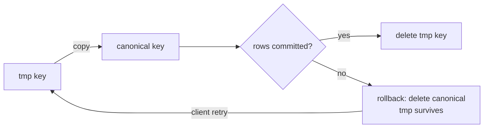

# Plan: 2026-09-17/18 production log RCA (Supabase HTTP/2 race, write retries, image promotion, provider overload)

Status: active
Started: 2026-09-18
Owner: agent

## Goal

RCA and fix every error class in the 2026-09-17T15:42Z → 2026-09-18T04:15Z
production log window on the Railway backend. Five independent defect classes
were stacked on top of each other, and the log made them look like one
unavailable-service event.

## RCA

| # | Log signature | Root cause | Fix |
|---|---------------|------------|-----|
| 1 | `RuntimeError: dictionary keys changed during iteration` → `Supabase pooled connection error` storm | postgrest builds its httpx client with `http2=True`. ONE multiplexed connection was shared by ~32 `asyncio.to_thread` workers, and httpcore 1.0.9 mutates `h2_state.streams` in `send_headers` *before* taking `_write_lock` (`httpcore/_sync/http2.py:249` vs the lock at `:465`). Concurrent mutation of that dict raised mid-iteration and poisoned the pool for every request behind it. | **P0** — build both Supabase clients on an explicit **HTTP/1.1** transport. HTTP/1.1 refuses concurrent reuse (`ConnectionNotAvailable`), so one request owns one connection and the race is structurally impossible. |
| 2 | Requests inflated to 8–26 s (25.7 s `POST /items`) and thread-executor starvation | postgrest's default client timeout is **120 s**, so a stalled request pinned a bounded `to_thread` worker for two minutes. | **P0** — injected client carries `Timeout(connect=5, read=15, write=15, pool=10)`. |
| 3 | `duplicate key value violates unique constraint "item_images_pkey"` (23505) | `execute_with_reconnect` retried plain `insert`s that carry **client-generated UUIDs**. A lost response (the HTTP/2 death above) made the retry replay a row that had actually landed. | **P1** — the three client-PK inserts (`items`, `item_images`, `outfits`) are now `upsert(on_conflict="id")`; the two DB-minted-PK inserts (`audit_events`, `promo_codes`) run with `max_retries=0`. |
| 4 | `Failed to move image: NoSuchKey` → permanent 503 burst on `POST /items` | `promote_temp_image_to_item` copied tmp→canonical and deleted the tmp source; when the DB write failed, the rollback deleted the canonical object. Both copies gone, so the client's retry (same tmp key) could never resolve. | **P2** — promotion is copy-only (`copy_temp_image_to_item`); rollback deletes canonical objects only and leaves the tmp source alive; tmp sources are deleted after the rows commit. |
| 5 | `WARNING: Exceeded concurrency limit.` + `Generation failed for item item-…` for every batch item, then `Circuit breaker OPEN … after 15 consecutive real call failures` / `Provider unavailable, failing fast` | `GENERATION_SEMAPHORE` (30) exceeds the Agnes image gateway's own cap, so a 30-wide batch had everything past the cap rejected. The rejection text arrives with statuses the retry logic treats as permanent, so nothing retried; each rejection was then recorded as a provider failure, and 3 consecutive failures open the breaker for a flat **120 s** — blocking every user of that key long after recovery. | **P3** — new provider-side concurrency gate (`AI_IMAGE_PROVIDER_CONCURRENCY`, default 15) around the outbound image POSTs; concurrency-limit bodies are treated as retryable overload with a ~2 s floor; overload gets its own short cooldown and never feeds the failure streak; the breaker cooldown is now adaptive (20 s → ×2 → 300 s cap, jittered). |
| 6 | `GET /api/v1/outfits/available-items` 500 `EXCEPTION | RemoteProtocolError` | raw `asyncio.to_thread(...).execute()` on one of the remaining unwrapped reads. | **P0** — wrapped in `execute_with_reconnect` (same for `_fetch_outfit`, the item-reference fetch, and the `create_item` rollback delete). |
| 7 | `Error incrementing usage … Broken pipe` | **Not a bug.** `SubscriptionService.increment_usage` is deliberately fail-closed (non-idempotent counter; retrying a lost response double-charges). See TD-045. | No change (documented in the write contract). |
| 8 | Boot-time missing env (`AI_ENCRYPTION_KEY`, 5 Stripe vars, `GIFT_TOKEN_SECRET` + 3 gift price IDs) and `/.env`, `/api/secrets`, `/wp-login.php` probe 404s | Prod env gaps (out of scope by decision) and bot scanners (cosmetic). | Ops, not code. |

## Code changes

### P0 — Supabase transport (`app/db/connection.py`, `app/utils/db.py`)

1. `_build_http_client()` → `httpx.Client(http2=False, follow_redirects=True,
   timeout=Timeout(5/15/15/10), limits=Limits(40, 20, keepalive_expiry=30))`,
   injected through `SyncClientOptions(httpx_client=…)` into both singletons
   (verified: postgrest and storage both use it; postgrest builds absolute
   URLs, so no `base_url` is needed on the injected client).
2. `rebuild_service_client()` closes the superseded **service** transport (it
   used to leak pools) and coalesces rebuilds inside a 2 s window so a failure
   wave cannot stampede `create_client`. The anon singleton is reset but its
   transport is left open: anon auth calls are not retried, so closing its pool
   under an in-flight sign-in would turn a recoverable blip into a 500.
   `reset()` closes both transports (test helper, no in-flight callers).
3. `db.py`: markers for `"dictionary keys changed during iteration"` and
   `"as the client has been closed"` (the close-superseded-transport race this
   change introduces); **pool timeouts retry on the SAME client** (a busy pool
   is not a dead pool — rebuilding it is what caused the stampede) while real
   connection deaths still rebuild. Write contract documented: anything inside
   `execute_with_reconnect` must be read-only, an upsert-on-PK, or an
   explicitly idempotent RPC.

### P1 — idempotent write retries

4. `items.py` items upsert; `items.py` item_images batch upsert; `outfits.py`
   create upsert (all `on_conflict="id"`).
5. `admin_service.py` promo_codes and `audit_service.py` audit_events:
   `max_retries=0` (DB-minted PKs; merging a duplicate would be wrong).

### P2 — copy-not-move promotion (`storage_service.py`, `items.py`)

6. `copy_temp_image_to_item()` beside `promote_temp_image_to_item()`, sharing a
   new `_copy_object()` helper. A source that is already gone counts as success
   **only** when the destination already exists (a concurrent promotion of the
   same key); otherwise NoSuchKey still raises. Note the destination is minted
   fresh per call, so promotion is *not* idempotent across attempts (see
   Deferred debt).
7. `create_item` records `(canonical, tmp_source)` pairs; success deletes the
   tmp sources **after** the rows commit; rollback deletes only canonical
   objects. `social_import_pipeline_service` keeps the move semantics.



### P3 — provider overload (`config.py`, `concurrency.py`, `ai_provider_service.py`, `ai_provider_health_service.py`, `batch_extraction_service.py`)

8. `AI_IMAGE_PROVIDER_CONCURRENCY` (default 15, raised from the initial 4 on
   2026-09-18) + `IMAGE_PROVIDER_SEMAPHORE` +
   reentrant `provider_image_slot()`, held around the outbound image POST
   (images API) and the `response_modalities` chat leg. Ordering is always
   generation slot → provider slot, so the two gates cannot deadlock.
9. Concurrency-limit bodies (`"exceeded concurrency limit"` and friends) are
   classified as retryable overload even when they arrive with a status that
   is otherwise permanent, or as a 200 with no images. Retry floor ~2 s (a
   sub-second retry re-enters the same full queue); `Retry-After` still wins.
10. `record_result(..., overload=True)`: does not advance or reset the
    consecutive-failure streak, installs a 10 s cooldown instead. The breaker
    cooldown is adaptive (`_breaker_cooldown`: 20 s doubling from the
    threshold, 300 s cap, ±25% jitter).
11. Batch generation retries `max_retries=1 → 2` with jittered backoff, parity
    with the extraction leg; content-policy 400s still fail fast.

## Verification

```bash
cd backend && source .venv/bin/activate
pytest                     # 4290 passed, 4 skipped, coverage 94.9% (gate 90%)
ruff check .
cd .. && python scripts/check_architecture.py && python scripts/check_docs_structure.py
cd flutter && flutter test  # 313 passed
```

One backend test fails in the shared working tree from a **concurrent** change
set (new `app/services/admin_user_generations_service.py`, its
`app/api/v1/admin/users.py` route and its new tests): a 422 on the new
`/admin/users/{user_id}/generations/{kind}/{generation_id}` enum in
`tests/api/test_admin_authz.py`. That file is untouched by this change set.
(The `image_failures` assertion and the unused import this workstream also hit
in `test_admin_user_generations.py` were fixed on their side while this change
set was being reviewed.)

New/updated tests: `tests/unit/test_utils/test_db_client_transport.py` (HTTP/1.1
transport shape, limits, timeouts, rebuild closes the stale transport, rebuild
coalescing, the new retry markers, pool timeout retried without a rebuild);
`test_db_connection_retry.py` (AST guard: no reconnect-wrapped plain inserts
without an explicit `max_retries`); `test_concurrency_config.py` +
`test_concurrency_slot.py` (provider cap, clamping, gate independence);
`test_ai_provider_service.py` (slot held during the POST, N-wide cap enforced,
overload body retried and recorded as overload, chat takes the slot only for
image requests, **exactly one recorded outcome per call — TD-108**);
`test_ai_provider_health_service_coverage.py` (adaptive + jittered cooldown,
overload never advances the streak);
`test_batch_extraction_service_coverage.py` (generation retry budget);
`test_items_routes_coverage.py` / `test_outfits_routes_coverage.py` (upsert
shape, tmp-source deletion after commit); Flutter:
`test/features/wardrobe/repositories/item_repository_request_id_test.dart`
(the key reaches the POST body), `test/core/utils/request_id_test.dart`
(`newRequestId` uniqueness/prefix/length, `requestIdIdentity` preferring the
model id and never collapsing two missing-id garments) and the re-tap-Save
replay tests in `item_add_controller_test.dart` (**TD-109**).

## Outcome

- HTTP/2 race closed **without** TD-043: the async-client migration is no
  longer required for correctness, only for event-loop hygiene.
- Throughput is now provider-bound: a 30-item batch runs ~15-wide (two waves)
  instead of 30-wide. That is the deliberate trade (bounded latency, zero
  concurrency rejections) and is tunable via `AI_IMAGE_PROVIDER_CONCURRENCY`
  (operator chose 15 over the initial 4 on 2026-09-18; the process-wide
  generation cap still bounds memory, and overload backoff covers the gateway
  if 15 turns out to be above its plan limit).

## Follow-up fixes (2026-09-18, same change set)

- **TD-108 — one recorded outcome per real provider call.** The defect was not
  the "recorded twice → streak +2" shape first assumed: a 200 whose body could
  not be parsed recorded a **success** (`chat()` recorded before parsing, which
  resets a genuine failure streak) and then a **failure** for the same call.
  Fixed by parsing first and recording after (`_record_chat_outcome`), with
  `AIServiceError.health_recorded` so the generic `except AIServiceError`
  handler does not record a second time when the parse itself failed. Verified
  with a probe over every failure path (transient, permanent, overload,
  empty-images, malformed, non-JSON): each now records exactly one outcome.
  `GeminiProvider.chat` is deliberately left as-is: it records success as soon
  as the network call returns, so a blocked/truncated body that fails to parse
  is request-level rather than an availability failure. `RELIABILITY.md` now
  scopes the invariant to `AIProviderService` and states the Gemini rule.
- **TD-109 — every item create sends an idempotency key.** Flutter minted none,
  so a retry after a committed-but-lost response (or a re-tap of Save on a
  partially failed batch) duplicated the item, or re-promoted a `tmp/` key the
  server had already deleted and answered a 503 no retry could clear. Added
  `newRequestId()` / `requestIdIdentity()` in `core/utils/request_id.dart` and a
  `clientRequestId` parameter on `ItemRepository.createItem` /
  `createItemWithImage`; the item-add, batch-save and manual-entry flows mint
  the key **once per item** and reuse it across retries (manual entry clears it
  after a successful save).
  `requestIdIdentity` is the one place that decides which id keys a save: the
  model's own id when it has one, otherwise the object's identity, so the
  `'unknown'` sentinel `DetectedItemData.fromJson` substitutes for a missing
  `temp_id` cannot make two garments share a key and collapse into one item.

## Deferred debt

- Promotion is not idempotent across attempts: `_promote_temp_image` mints a
  fresh canonical key per call, so a create replayed *without* a
  `client_request_id` writes a second canonical object and leaves the first one
  DB-unreferenced. Bounded, covered by the weekly `storage_inventory.py
  --delete` orphan sweep, and unreachable for both shipped clients now that they
  send keys (TD-109); the alternative was the permanent NoSuchKey 503 the copy
  replaces.

## Not doing (explicit decisions)

- Railway env vars (`AI_ENCRYPTION_KEY`, 5 Stripe vars, `GIFT_TOKEN_SECRET` +
  3 gift price IDs) stay unset → web checkout and gift issuance keep failing
  closed with 503. The startup lines are accurate, not bugs.
- Scanner probes (`/api/.env`, `/api/secrets`, `/wp-login.php`, `/admin/`)
  stay logged as 404s.
- No live smoke against hosted Supabase was run from this change set.
