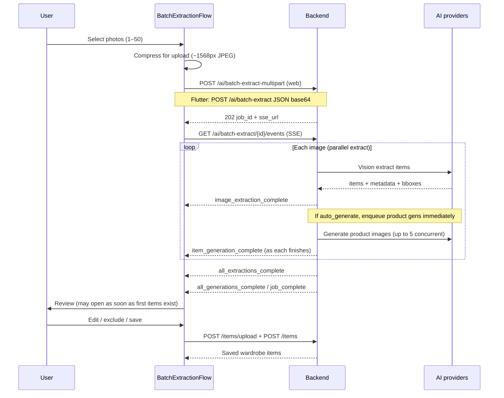

# Implementation: Workflows

## Overview

Detailed user flows and state management transitions for key features.

## 1. Wardrobe Batch Upload (AI extract + product images)

Primary onboarding / add-items path. Web uses multipart; Flutter uses JSON base64 for job start.

**Notes:**
- Extraction and product generation **overlap** on multi-image jobs.
- `generation_started` may arrive **before** `all_extractions_complete`.
- Review-first UX: user can edit and save while studio photos still polish.
- Soft-close dialog keeps job running; app job pill can reopen progress.

## 2. AI Try-On Generation

1. **Selection:** User selects clothing image (and has a profile photo).
2. **Initiation:** User clicks generate try-on.
3. **Config:** Style / background / pose options.
4. **Request:** Client calls try-on AI endpoint with clothing + avatar.
5. **Processing:** Server generates composite image.
6. **Display:** Result shown; long waits use generating surface + optional job pill.

## 3. Weather-Based Suggestions

1. **Trigger:** User opens Dashboard or recommendations.
2. **Fetch:** Weather + wardrobe-aware recommendation APIs.
3. **Logic:** Match conditions / seasons / occasions to owned items.
4. **UI:** “What to wear” style suggestions from the wardrobe.

## 4. Packing Assistant

1. **Input:** User enters destination and dates.
2. **AI Analysis:** Forecast + wardrobe context.
3. **Generation:** Suggests items that cover multiple outfits.
4. **Checklist:** User checks off packed items.
