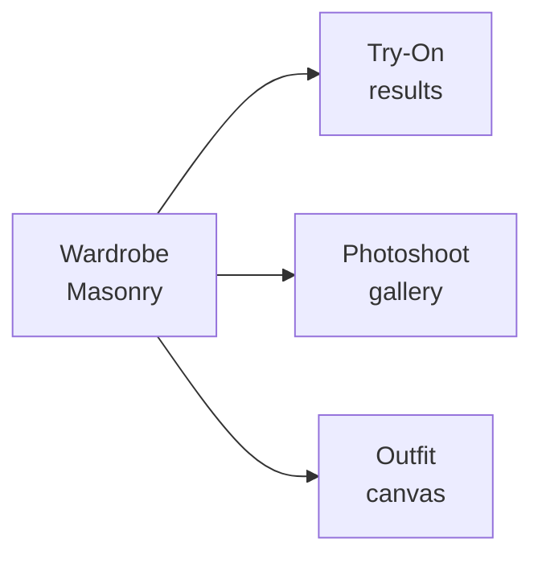

# DESIGN.md — FitCheck AI (Mobile / Flutter)

Mobile parity reference for AI coding agents working on the Flutter client
(`flutter/` using GetX). It mirrors the web design language so the app feels
like one product across web and mobile. Every new screen follows this visual
language, not a generic Material/Apple default.

Direction: **Wardrobe Studio** — calm, image-forward, photos first, chrome
quiet. Inspired by Pinterest (red accent, masonry grid, flat surfaces) and
Airbnb (soft warm neutrals, rounded UI). This is the token source of truth for
mobile; product intent and the processing-status vocabulary live in
`docs/DESIGN.md`.

> Stack note: theme is centralized in `lib/app/themes/` — `app_colors.dart`,
> `app_theme.dart`, `app_text_styles.dart`. Feature modules live under
> `lib/features/`. Talk to the same FastAPI backend as web (`API_BASE_URL`).

> Migration note: this replaces the legacy indigo primary in `app_colors.dart`
> (`primary = Color(0xFF6366F1)`) with Brand Red. The current `secondary` rose
> (`#F43F5E`) is close to the new accent; consolidate to a single Brand Red.

---

## 01 — Color

Pinterest Red carries every primary action. Everything else is monochrome
neutral with a faint warm cast. One brand accent + one editorial secondary
(purple) for AI-pick badges. All values are Flutter `Color(0xAARRGGBB)`.

### Brand & Accent

| Token | Hex / Flutter | Use |
|-------|---------------|-----|
| `primary` (Brand Red) | `#e60023` → `Color(0xFFE60023)` | Primary CTA, active-tab indicator, brand marks |
| Brand Red Pressed | `#cc001f` → `Color(0xFFCC001F)` | Pressed state |
| Editorial Purple | `#7e238b` → `Color(0xFF7E238B)` | "AI pick" / recommendation badges only |
| `onPrimary` | `#ffffff` → `Color(0xFFFFFFFF)` | Text/icon on red |

### Surfaces (warm neutral, light)

| Token | Hex / Flutter | Use |
|-------|---------------|-----|
| Canvas | `#ffffff` → `Color(0xFFFFFFFF)` | Screen background, cards, modals |
| Soft Surface | `#fbfbf9` → `Color(0xFFFBFBF9)` | Cream-tinted screen wash |
| Surface Card | `#f6f6f3` → `Color(0xFFF6F6F3)` | Tile background, search-bar fill |
| Secondary BG | `#e5e5e0` → `Color(0xFFE5E5E0)` | Secondary button fill |
| Surface Dark | `#262622` → `Color(0xFF262622)` | Warm near-black CTA strips |
| Hairline | `#dadad3` → `Color(0xFFDADAD3)` | 1px dividers |

### Text

| Token | Hex / Flutter | Use |
|-------|---------------|-----|
| Ink | `#000000` → `Color(0xFF000000)` | Headlines, button-on-primary text |
| Ink Soft | `#211922` → `Color(0xFF211922)` | Inline links in prose |
| Body | `#33332e` → `Color(0xFF33332E)` | Default paragraph text |
| Mute | `#62625b` → `Color(0xFF62625B)` | Metadata, secondary captions |
| Ash | `#91918c` → `Color(0xFF91918C)` | Disabled text, placeholders |

### Semantic

| Token | Hex / Flutter | Use |
|-------|---------------|-----|
| Error | `#9e0a0a` → `Color(0xFF9E0A0A)` | Validation messages |
| Success Deep | `#103c25` → `Color(0xFF103C25)` | Success messaging |
| Success Pale | `#c7f0da` → `Color(0xFFC7F0DA)` | Success-pill background |
| Focus Outer | `#435ee5` → `Color(0xFF435EE5)` | Focus ring |

### Dark mode

Warm near-black surfaces, not neutral: background `#1a1a17`, surface `#232320`,
raised `#2c2c28`, hairline `#3a3a35`. Text inverts to `#fbfbf9` / `#62625b`.
Keep Brand Red at full saturation so primary actions stay loud against dark.
Use `ThemeData` light/dark with a `ColorScheme` built from these tokens
(`app_theme.dart`).

---

## 02 — Typography

All-sans, matching web. Use **Plus Jakarta Sans** via `pubspec.yaml` asset; fall
back to the system sans. Steep hierarchy, tight tracking on display tiers.

| Role | Size / Weight / lh | Tracking | Flutter (`TextStyle`) |
|------|---------------------|----------|----------------------|
| `display-xl` | 70 / 600 / 1.1 | -1.2 | `headlineLarge` |
| `display-lg` | 44 / 700 / 1.15 | -0.8 | `headlineMedium` |
| `heading-xl` | 28 / 700 / 1.2 | -1.2 | `headlineSmall` |
| `heading-lg` | 22 / 600 / 1.25 | 0 | `titleLarge` |
| `heading-md` | 18 / 600 / 1.3 | 0 | `titleMedium` |
| `body-md` | 16 / 400 / 1.4 | 0 | `bodyLarge` |
| `body-strong` | 16 / 600 / 1.4 | 0 | `bodyLarge` (`w600`) |
| `body-sm` | 14 / 400 / 1.4 | 0 | `bodyMedium` |
| `caption-md` | 12 / 500 / 1.5 | 0 | `bodySmall` / `labelSmall` |
| `button-md` | 14 / 700 / 1 | 0 | `labelLarge` |

Centralize these in `app_text_styles.dart`; consume via `Theme.of(context)`
wherever possible so light/dark swaps automatically.

---

## 03 — Components

### Buttons

| Variant | Spec |
|---------|------|
| `primary` | `bg` Brand Red + `onPrimary` text; `rounded-16`; `h-44` |
| `secondary` | `bg` Secondary BG + Ink text; `rounded-16` |
| `tertiary` | transparent + Ink text; `rounded-16` |
| `pill-on-image` | `bg` Canvas + Ink text; `rounded-full`; over photography |
| `disabled` | `bg` Surface Card + Ash text |

Implement as `FilledButton` (primary), `FilledButton.tonal` (secondary),
`TextButton` (tertiary) with a shared `ButtonStyle` so radius/height stay
consistent. Sentence-case, imperative copy ("Save outfit").

### Chips & search

- **FilterChip:** default = Surface Card fill; selected = Ink fill + on-dark text.
  `rounded-full`, ~40px height. Use Flutter `FilterChip` with custom style.
- **Search bar:** `bg` Surface Card, `rounded-full`, `h-48`. Magnifier icon
  overlay; clear (x) button when populated.

### Cards

- **Item/Pin card:** flat, no elevation, `rounded-16`, hairline border on
  focus/hover only. `rounded-32` for large cards/modals.
- **Modal/sheet:** `rounded-32` top corners on a bottom sheet (`showModalBottomSheet`),
  the only surface that receives a scrim shadow.

### Bottom navigation

`BottomNavigationBar` / custom bar at `--bottom-nav-height: 64px` equivalent.
Active tab = Brand Red indicator + filled icon. Honor safe-area bottom inset
(`MediaQuery.paddingOf` / `SafeArea`). 4–5 top-level destinations (Wardrobe,
Outfits, Try-On, Photoshoot, Profile).

### Wardrobe Masonry Grid (mobile)

Column masonry preserving each garment's natural aspect ratio — never crop to
square. Use a `SliverMasonryGrid.count` (via `flutter_staggered_grid_view` or
equivalent) so items lay out at their own height.

- Tile radius 16px (32px for hero tiles)
- Gutters 8px (6px on narrow phones)
- Columns: 3 tablet → 2 phone → 1 small phone
- Flat tiles; tap reveals detail; long-press shows a `Save` pill-on-image

---

## 04 — Layout & Spacing

8px base with finer 4/6px steps. Section rhythm 64px. Express as a constants
class (e.g. `Spacings`) and consume via `SizedBox` / `Padding` — never hardcode
magic numbers in widgets.

| Name | Value |
|------|-------|
| xxs | 4 |
| xs | 6 |
| sm | 8 |
| md | 12 |
| lg | 16 |
| xl | 24 |
| xxl | 32 |
| section | 64 |

---

## 05 — Shapes (Radius)

Three values; no mid-radius between md and lg. Expose via a `Radii` constants
class or `RoundedRectangleBorder(borderRadius: ...)`.

| Token | Value | Use |
|-------|-------|-----|
| none | 0 | Footer, page sections |
| sm | 8 | Rare tooltip |
| md | 16 | Buttons, inputs, item cards, feature cards |
| lg | 32 | Large cards, modals/sheets |
| full | 9999 | Search, chips, overlay pills, avatars |

---

## 06 — Depth & Elevation

Content surfaces are **flat**. No `elevation` on cards/grids/tiles — set
`Material` elevation 0. The only shadow lives on the modal/bottom-sheet layer
(scrim). Hairline borders (1px Hairline token) define edges, not shadows.

---

## 07 — Motion

Subtle state changes only (opacity, hairline appearance, micro-translate).
Never strand content at opacity 0 behind a stuck entrance animation. Honor
`MediaQuery.disableAnimations` / platform reduce-motion. Long AI jobs use the
processing-status vocabulary below — honest progress, never fake completion.

---

## 08 — Accessibility

- **WCAG AA** contrast on all text.
- **Touch targets:** 44px minimum (Material min tap target). Buttons ~40px with
  inline padding extend to 44px.
- Semantic labels on icon-only `IconButton`s (`tooltip` / `Semantics`).
- Visible focus on interactive elements.

---

## 09 — Processing-status vocabulary (AI jobs)

Every flow that waits on a backend job aligns its copy to this table. Never
fabricate progress or completion. Drives batch upload, photoshoot, try-on,
outfit generation, social import, avatar upload.

| Phase | When | Copy pattern |
|-------|------|--------------|
| Uploading | Client sending image bytes | "Uploading photo…" (+ real byte % if available, else indeterminate) |
| Queued | Backend genuinely queued (batch, photoshoot, social import) | "Queued…" |
| Processing (phase-specific) | Backend reports a real sub-phase via SSE | Backend's own strings: "Extracting items…", "Generating photos…", "3 of 10 processed" |
| Processing (opaque) | Single sync call, no phases (try-on, outfit gen, avatar) | "Processing… (Ns elapsed)" — elapsed only, never fake % |
| Done | Terminal success | Brief confirmation |
| Failed | Terminal failure | Real error message + retry action |

Prefer backend batch extract JSON base64 start endpoint from Flutter; SSE for
progress (see `docs/BACKEND.md` batch section and `docs/FLUTTER.md`).

---

## Related

- `docs/DESIGN.md` — product intent + canonical processing-status source.
- `frontend/DESIGN.md` — web parity for the same tokens.
- `docs/FLUTTER.md` — mobile architecture, commands, conventions.
