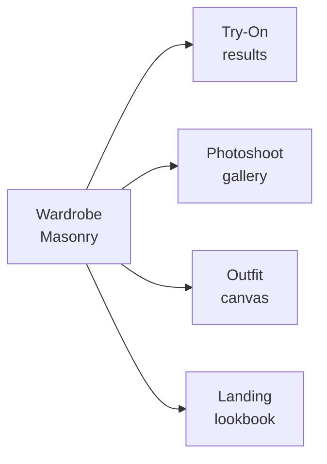

# DESIGN.md — FitCheck AI (Web)

A reusable design reference for AI coding agents working on the FitCheck web app
(React + Vite + Tailwind + shadcn-style primitives in `src/components/ui/`).
Every new page should follow this visual language, not a generic AI/SaaS layout.

Direction: **Wardrobe Studio** — a calm, image-forward "practical wardrobe studio."
Photos and outfit canvases come first; chrome is quiet and recedes. Inspired by
Pinterest (red accent, masonry grid, image-first) and Airbnb (soft warm neutrals,
rounded UI), now re-based onto the **clay system** (`docs/exec-plans/active/clay-rebuild.md`):
warm cream canvas, oat borders, and "pressed into clay" depth instead of the
previous flat-editorial look. This doc is the token source of truth;
`docs/DESIGN.md` holds the product intent and the processing-status vocabulary.

> Stack note: Tailwind tokens are CSS variables in `src/index.css` (shadcn/ui
> convention, HSL channel values). UI primitives live in `src/components/ui/`.
> Extend existing primitives — never invent a second ad-hoc system.

---

## 01 — Color

Pinterest Red carries every primary action. Everything else is monochrome
neutral with a faint warm cast. There is exactly **one** brand accent plus a
single editorial secondary (purple) for AI-pick / recommendation badges.

### Brand & Accent

| Token | Hex | Use |
|-------|-----|-----|
| `--primary` (Brand Red) | `#e00016` → `hsl(354 100% 44%)` | Primary CTA, brand marks, active-tab indicator |

> Brand Red moved from `hsl(354 100% 45%)` (`#e60023`) to `44%` on 2026-07-31. At 45% it
> measured **4.46:1** against `--card`, so `text-primary` on any card panel failed AA by
> 0.04. 44% measures 4.63:1 on card and 5.01:1 on canvas, keeps the 100% saturation this
> section requires, and shifts the hex by one perceptual step. `scripts/check_theme_tokens.py`
> enforces the floor, so this cannot silently regress.

| Brand Red Pressed | `#cc001f` → `hsl(351 100% 40%)` | Pressed state for primary button |
| Editorial Purple | `#7e238b` → `hsl(292 60% 34%)` | "AI pick" / recommendation badges only |

> Migration note: this replaces the legacy indigo `--primary: 238.7 83.5% 66.7%`.

### Surfaces (clay warm neutral, light — hue 40–45, never a cool gray)

The canvas carries the warmth so pure-white cards read as raised against it
(clay.com's core depth trick). Updated 2026-09-13 by the clay rebuild.

| Token | Var | Hex | HSL channels | Use |
|-------|-----|-----|--------------|-----|
| Canvas (cream) | `--background` | `#fcfaf8` | `40 33% 98%` | Page background, inputs |
| Surface Card (white) | `--card` | `#ffffff` | `0 0% 100%` | Raised cards, tiles, search-bar fill |
| Soft Surface (`surface-soft`) | `--surface-soft` | `#faf8f5` | `40 33% 97%` | Faint cream page wash |
| Deeper cream room (`surface-room`) | `--surface-room` | `#f4eedc` | `45 52% 91%` | Alternating tinted section "rooms" — max one per viewport |
| Secondary BG | `--secondary` | `#f0ece6` | `40 25% 92%` | Secondary button fill |
| Muted | `--muted` | `#f4f1eb` | `40 28% 94%` | Placeholder surfaces, letterboxes |
| Hairline (oat) | `--border` | `#dad4c8` | `40 20% 82%` | 1px row dividers, column rules, card edges |
| Light oat (`border-soft`) | `--border-soft` | `#ede8de` | `40 31% 90%` | Inner edges, soft fill tiers |
| Warm silver (`silver`) | `--silver` | `#9f9b93` | `40 6% 60%` | Decorative large labels/kickers ONLY — never running copy (fails 4.5:1); use `mute`/`body` there |

Borders are always oat (hue 40); a neutral `#ccc/#ddd` gray border is a slop
tell and a token regression.

There is no dark-CTA-strip surface token. A rare dark strip uses `bg-ink`, whose
label is `text-on-dark` — and both invert, so the strip stays a strip in dark.

**Light is the default theme.** A visitor with no saved choice gets light,
whatever the OS preference says; Dark and System are explicit picks in the
theme toggle (`src/components/theme/`, `fitcheck-theme` in localStorage). The
default is declared in three places that must stay in step: the pre-hydration
script in `index.html`, `ThemeProvider`'s `defaultTheme`, and its call sites
(`main.tsx`, `entry-prerender.tsx`).

### Text

| Token | Var | HSL channels | Hex | vs `--background` | vs `--card` | Use |
|-------|-----|--------------|-----|---|---|-----|
| Ink (`ink`) | `--foreground` | `40 12% 9%` | `#1a1814` | 17.09 | 17.75 | Headlines, primary nav links — warm near-black |
| Body (`body`) | `--body` | `40 5% 23%` | `#3e3c38` | 10.65 | 11.07 | Default paragraph text — warm gray |
| Mute (`mute`) | `--muted-foreground` | `40 4% 38%` | `#65625d` | 5.84 | 6.06 | Metadata, secondary captions, footer links |
| Ash (`ash`) ‡ | `--ash` | `40 3% 43%` | `#716f6a` | 4.84 | 5.03 | Disabled text, placeholders |
| Warm silver (`silver`) | `--silver` | `40 6% 60%` | `#9f9b93` | 2.96 | 3.06 | Decorative kickers/large labels only (never content) |
| Stone | *(hex, light-locked)* | — | `#c8c8c1` | 1.65 | 1.53 | Least-emphasis utility text, disabled borders (never text) |

‡ Ash is the placeholder / disabled tier. Placeholder text is content, so its
4.5:1 floor is enforced by `scripts/check_theme_tokens.py`. On the clay canvas
`43%` at hue 40 measures 4.84:1 on `--background` and 5.03:1 on `--card` (the
focused-input and disabled-button backdrops). Do not lighten past 43%; keep
ash inside controls and mute in body copy so the two tiers never sit adjacent.
Ash on `--secondary` measures 4.28 and is out of contract; a secondary
button's label is `text-secondary-foreground` and a disabled button repaints
to `bg-surface-card`, so that pairing does not occur.

### Semantic

| Token | Var | Hex | Use |
|-------|-----|-----|-----|
| Error (`error`) | `--error` | `#9e0a0a` | Validation messages |
| Error Pale (`error-pale`) | `--error-pale` | `#f9e7e7` | Pale error-pill background |
| Success (`success`, `success-deep`) | `--success` | `#103c23` | In-product success messaging |
| Success Pale (`success-pale`) | `--success-pale` | `#c7f0d7` | Pale success-pill background |
| Editorial Purple (`accent-purple`) | `--accent-purple` | `#84238b` | "AI pick" badge fill; label is always `text-white` |
| Focus ring (`ring`) | `--ring` | `#e60023` | Focus outline (paired with `--focus-inner` gap) |

> Every token in these tables except `stone` resolves through
> a CSS variable, so it inverts. A fixed hex in `tailwind.config.ts` has no
> `.dark` counterpart in the emitted CSS — that is precisely how dark mode
> broke. Add colors as a `:root` + `.dark` var pair, never as a literal.

### Editorial tints (added 2026-09-01)

One brand accent, five editorial tints. The tints give dashboards, empty
states, and landing icon marks warmth without becoming second brand colors:
they decorate *marks and small tiles* (icon chips, accent bars, kicker dots),
never flood panels or rows. Each tint is a `DEFAULT` (deep, text/icon role) +
`-pale` (fill) pair with the same contract as `--success` / `--success-pale`:
roles invert in dark mode, and `scripts/check_theme_tokens.py` asserts every
pair at ≥4.5:1 in BOTH themes via `PAIRED_FILLS`.

| Tint | Light deep / pale | Dark deep / pale | Measured |
|------|-------------------|------------------|----------|
| `--tint-coral` | `#af301d` / `#fce1d9` | `#f59f89` / `#432019` | 5.17 / 7.00 |
| `--tint-amber` | `#985716` / `#fbebd0` | `#f4c87b` / `#433119` | 4.85 / 7.95 |
| `--tint-teal` | `#176d62` / `#d6f5f1` | `#85e0d1` / `#15322e` | 5.32 / 8.91 |
| `--tint-violet` | `#7a3399` / `#f0dff6` | `#d69aea` / `#3b1f47` | 6.01 / 6.57 |
| `--tint-blue` | `#27599b` / `#dceaf9` | `#88bdf2` / `#1c2b40` | 5.73 / 7.17 |

Usage rules:

- Utilities are `text-tint-*` / `bg-tint-*-pale` (Tailwind `tint.*` map). A
  tinted *label* always rides its own `-pale` fill — never a tint directly on
  `--background`/`--card`.
- AI/recommendation badges keep `accent-purple`; the AI tool voice does not
  fragment across the five tints.
- Category/condition indexes (`event-*`, `condition-*`) keep their quieter
  tonal band; they are data encodings, not decoration.

### Dark mode

Warm near-black at **hue 60**, never a cool slate or blue-charcoal base. Every
token below is a real `.dark` entry in `src/index.css`; `src/index.css` is the
source of truth and this table is derived from it.

**The three tokens with no separate name.** `hairline`, `ink` and `surface-card`
are not independent colors — they *are* `--border`, `--foreground` and `--card`.
`text-ink` emits `hsl(var(--foreground))`, `border-hairline` emits
`hsl(var(--border))`, `bg-surface-card` emits `hsl(var(--card))`. Do not add a
second variable for any of them.

Surfaces:

| Role | Var | `.dark` HSL | Hex |
|---|---|---|---|
| Canvas | `--background` | `60 5% 10%` | `#1b1b18` |
| Surface card (`surface-card`) | `--card` | `60 5% 13%` | `#23231f` |
| Soft surface (`surface-soft`) | `--surface-soft` | `60 5% 16%` | `#2b2b27` |
| Secondary / raised | `--secondary` | `60 5% 17%` | `#2e2e29` |
| Deeper cream room | `--surface-room` | `45 10% 14%` | `#272520` |
| Hairline (`hairline`) | `--border` | `45 8% 24%` | `#424038` |
| Light oat (`border-soft`) | `--border-soft` | `45 8% 20%` | `#37352f` |
| Warm silver (`silver`) | `--silver` | `45 6% 58%` | `#9a978d` |

Dark borders shift to hue 45 so the oat warmth survives the inversion; the
near-black base stays at hue 60.

Text and accent, with measured WCAG ratios against `--background` / `--card` /
`--secondary`:

| Role | Var | `.dark` HSL | Hex | bg | card | secondary |
|---|---|---|---|---|---|---|
| Ink (`ink`) | `--foreground` | `60 20% 98%` | `#fbfbf9` | 16.68 | 15.24 | 13.24 |
| Body (`body`) | `--body` | `60 10% 88%` | `#e3e3dd` | 13.48 | 12.31 | 10.70 |
| Mute (`mute`) | `--muted-foreground` | `60 6% 62%` | `#a4a498` | 6.87 | 6.27 | 5.45 |
| Brand red (`text-primary`) | `--primary` | `354 100% 62%` | `#ff3d51` | 4.98 | 4.54 | 3.95 † |
| Error | `--error` | `0 85% 68%` | `#f36868` | 5.75 | 5.25 | 4.57 |
| Ash (`ash`) ‡ | `--ash` | `60 5% 52%` | `#8b8b7e` | 5.00 | 4.57 | 3.97 |

† `text-primary` never sits on `bg-secondary` (a secondary button carries
`text-secondary-foreground`). Light mode measures 3.83 on the same pair — this
is the brand red's inherent limit, not a dark-mode defect.
‡ Ash is the placeholder / disabled tier only. Its real backdrops are
`--background` (inputs) and `--card` (disabled buttons), both ≥4.5.

Paired fills, where the label sits on its own surface rather than the page:

| Pair | `.dark` | Ratio |
|---|---|---|
| `--primary-foreground` on `--primary` | `#161613` on `#ff3d51` | 5.23 |
| `--success` on `--success-pale` | `#c7f0d7` on `#103c23` | 9.89 |
| `--error` on `--error-pale` | `#f36868` on `#431919` | 5.02 |
| white on `--accent-purple` | `#fff` on `#ad35b6` | 5.30 |
| `on-dark` on `ink` (active filter chip) | `#000` on `#fbfbf9` | 20.25 |

Two inversions look wrong and are deliberate:

- **`--primary-foreground` goes near-black** (`60 6% 8%`). White on the
  lightened red is only 3.5:1; near-black is 5.23:1. Anything that puts a label
  on `bg-accent-purple` must therefore say `text-white` explicitly.
- **`--success` / `--success-pale` swap.** `--success` is the *text* role,
  `--success-pale` the *fill* role. On dark the text goes pale and the fill goes
  deep. Do not "un-invert" them.

**`on-image` is identical in both themes.** `--on-image` / `--on-image-foreground`
are white / black in `:root` *and* `.dark`, because they clothe chrome floating
over a garment photograph (the `pill-on-image` button, the select disc, the
favourite disc, the pin overlay pill). Their backdrop is the image, not the
page. This is what `pill-on-image: bg canvas + text ink` means below: canvas
*white*, not "whatever the page background happens to be".

Keep the red at full saturation so primary actions stay loud against dark.

---

## 02 — Typography

All-sans, like Pinterest. Use **Inter** for UI/body text and **Manrope** for
display tiers, loaded in `src/main.tsx`. No serif. Steep hierarchy: display drops straight to
16px body with no intermediate display tier.

| Role | Size / Weight / lh | Tracking | Use |
|------|---------------------|----------|-----|
| `display-xl` | clamp(56–80px) / 600 / 1.05 | -0.03em | Landing hero (`clamp(3.5rem, 8vw, 5rem)`), marketing display |
| `display-lg` | 44px / 600 / 1.12 | -0.03em | Section headlines |
| `heading-xl` | 28px / 600 / 1.2 | -0.02em | Page headers |
| `heading-lg` | 22px / 600 / 1.25 | 0 | Section titles |
| `heading-md` | 18px / 600 / 1.3 | 0 | Card title, in-grid label |
| `body-md` | 16px / 400 / 1.4 | 0 | Default body, modal copy |
| `body-strong` | 16px / 600 / 1.4 | 0 | Inline emphasis, nav link |
| `body-sm` | 14px / 400 / 1.4 | 0 | Footer, metadata, helper text |
| `body-sm-strong` | 14px / 700 / 1.4 | 0 | Result-count labels |
| `caption-md` | 12px / 500 / 1.5 | 0 | Captions, link metadata |
| `button-md` | 14px / 700 / 1 | 0 | Primary/secondary buttons |
| `button-sm` | 12px / 700 / 1 | 0 | Compact pill chips |

Display tiers never exceed weight 600 — never extra-bold (clay rule). Display
tiers use the `.font-display` utility plus the baked-in negative tracking in
`.type-display-*` / `.landing-display` (−0.03em). Marketing sections set body
copy at 18px/1.6.

---

## 03 — Components

Extend the shadcn primitives in `src/components/ui/` along these specs. Do not
duplicate variants — edit the primitive.

### Buttons

All buttons use `rounded-md` (12px). Solid variants (`default`, `primary`,
`destructive`, `secondary`) carry the clay depth treatment: `shadow-pressed` at
rest, `hover:shadow-offset` + a −1px,−1px diagonal shift, `active:shadow-none`
(pressed flat into clay). Quiet variants (ghost/tertiary/outline/link/
pill-on-image/icon-circular) stay flat.

| Variant | Spec |
|---------|------|
| `primary` | `bg-primary` (red) + `text-primary-foreground`; `rounded-md` (12px); `h-11` (44px); clay pressed/offset depth |
| `primary-pressed` | `bg` Brand Red Pressed |
| `secondary` | `bg secondary` (oat `#f0ece6`) + `text ink`; clay depth |
| `tertiary` | transparent + `text ink`; flat |
| `pill-on-image` | `bg canvas` + `text ink`; `rounded-full`; sits over photography; flat |
| `icon-circular` | `bg surface-card`; 44px circle; `rounded-full`; flat |
| `disabled` | `bg surface-card` + `text ash`, no shadow |

Button copy is sentence-case, imperative ("Save outfit", "Add to wardrobe").

### Chips & search

- **FilterChip:** default = `bg surface-card`; active = `bg ink` + `text on-dark`.
  Pills, `rounded-full`, ~36–40px height extending to 44px tappable via padding.
- **PillSearch:** `bg surface-card`, `rounded-full`, `h-12` (48px). Focus = canvas
  bg + 1px ash border, magnifier icon overlay on mobile.

### Cards

- **Every card rests pressed:** the `Card` primitive applies `shadow-pressed`
  (stamped into the page, not floating). The hairline border stays for edges.
- **Interactive cards:** `Card variant="interactive"` (or the `.card-interactive`
  utility) swaps the pressed stack for the hard `shadow-offset` on hover/focus
  with a small diagonal rise — the clay signature interaction.
- **Feature card:** white card on cream canvas; `rounded-2xl` (24px).
- **Modal card:** centered ~480px desktop, full-width sheet on mobile.

### Forms

- **Inputs/Textarea/Select:** `rounded-md` (12px), `h-11` (44px), canvas bg,
  1px ash border, `shadow-pressed` — fields are stamped into the page.
- **Focus signal:** 2px solid `--ring` outline + `--focus-inner` gap. Never a
  single colored outline.

### Bottom nav (mobile)

`--bottom-nav-height: 64px` (already a token). Active tab = Brand Red indicator.
Honor `--safe-area-bottom` via `.pb-bottom-nav`.

---

## 04 — Signature: Wardrobe Masonry Grid

The defining layout. A column-based masonry that preserves each garment's
natural aspect ratio — never crops, never forces square tiles. Drives the
Wardrobe browse, Try-On results, Photoshoot gallery, and outfit canvases.

- Tile radius 16px (`rounded-lg`; 24px for large/hero tiles)
- Gutters 8px (6px on mobile) so imagery effectively touches across columns
- Columns: 5–6 ultrawide → 4 desktop → 3 → 2 tablet → 1 mobile
- Flat tiles; on hover/focus a hairline + subtle `Save` pill-on-image appears

---

## 05 — Layout & Spacing

8px base with finer 4/6px steps for tight inline gaps. Section rhythm is 64px.

| Name | Value |
|------|-------|
| xxs | 4 |
| xs | 6 |
| sm | 8 |
| md | 12 |
| lg | 16 |
| xl | 24 |
| xxl | 32 |
| section | 64 |

Max content width holds at 1280px even on ultrawide; the masonry expands columns,
not the page width.

---

## 06 — Shapes (Radius)

Clay radius scale (clay-rebuild brief). `tailwind.config.ts` remaps the
Tailwind steps so existing class names land on the clay geometry:

| Token | Value | Use |
|-------|-------|-----|
| none | 0 | Full-bleed page sections |
| `rounded-sm` / DEFAULT | 8 | Small inline elements |
| `rounded-md`, `--radius` | 12 | Buttons, inputs, selects, standard controls |
| `rounded-lg` | 16 | Medium groupings |
| `rounded-xl` / `2xl` / `3xl` | 24 | Feature cards, panels, landing panels |
| `rounded-[2rem]` | 32 | Section containers |
| `rounded-[2.5rem]` | 40 | Page-width containers (footer, final CTA wrapper) |
| `rounded-full` | 9999 | Search bar, filter chips, overlay pills, avatars |

Set `--radius: 0.75rem` (12px) in `:root`.

---

## 07 — Depth & Elevation (the "pressed into clay" signature)

The old flat rule ("all box-shadows are none") is **revoked** by the clay
rebuild. Two var-backed shadows (re-tuned in `.dark`) do all the work —
`shadow-sm..2xl` remain `none` so stray legacy classes stay flat:

- **`shadow-pressed`** (resting) — 3-layer stack:
  `0 1px 1px rgba(0,0,0,0.10), inset 0 -1px 1px rgba(0,0,0,0.04),
  0 -0.5px 1px rgba(0,0,0,0.05)`. Cards feel stamped in, not floating. Applied
  by default to `Card`, badges, inputs; use on primary cards (pricing, demo
  panels, hero canvas, highlight tiles) — NOT on every div.
- **`shadow-offset`** (hover) — hard no-blur offset `rgb(0,0,0) -7px 7px` plus a
  small `translate(-1px,-1px)` rise at ~150ms ease-out. The signature
  interaction; visible, not subtle.
- **Ready-made patterns** in `src/index.css`: `.card-interactive` (resting
  pressed + hover/focus-within offset, reduced-motion aware) and `.lift` (same
  treatment for buttons/links outside the Button primitive).
- Dark mode re-tunes the pressed alphas heavier (0.55/0.35) so the cast edge
  still reads on near-black; the hard offset stays pure black.

---

## 08 — Motion

Subtle state changes only (opacity, hairline appearance, micro-translate). Never
hide primary content behind entrance animations that can strand opacity at 0.
Always honor `prefers-reduced-motion` (the global `@media` reset already exists
in `src/index.css`). Long AI jobs use the processing-status vocabulary below —
honest progress, never fake completion animations.

### Product motion system (updated 2026-09-01)

Sanctioned interaction feedback, all transform/opacity only and reduced-motion
safe. These live in the primitives, not per call site:

- **Press scale** — every Button gets `motion-safe:active:scale-[0.97]`; the
  FAB and icon-circular variants scale slightly more. Press feedback should
  feel mechanical, not like a repaint.
- **Clay offset hover** — `Card variant="interactive"` (and solid Button
  variants) rest pressed (`shadow-pressed`) and rise into the hard
  `shadow-offset` with a small `translate(-1px,-1px)` at ~150ms ease-out on
  hover/focus. The offset shadow grounds the motion, replacing the old bare
  "grounded lift" translate. Shadow swaps still fire under reduced motion;
  only the translate is motion-safe gated.
- **Shimmer** — the `.skeleton` class sweeps a transform-only highlight over
  the resting tone (replaces flat `animate-pulse`); direction communicates
  "loading", which a pulse never did.
- **Toast spring** — toasts enter on `animate-toast-in` (380ms
  cubic-bezier(0.22,1,0.36,1) with a small overshoot); swipe/exit behavior is
  unchanged from tailwindcss-animate.
- **Tab indicator pop** — BottomNav's active pill replays a 200ms scale-in on
  activation (remount-by-key), never on hover.

### Enterprise landing guidance (updated 2026-08-27)

Marketing pages use a **CSS-only** motion system (the "Landing motion system"
block in `src/index.css`; JSX hook is `components/landing/AnimatedSection.tsx`).
The public landing page adds these rules without changing the foundational
system above:

- **The signature is an outfit decision canvas.** Combine wardrobe imagery,
  one selected flat lay, and plain-language product reasoning. Do not use a
  generic phone frame, fake controls, invented activity counts, or screenshots
  that expose personal information.
- **Enterprise trust comes from verified facts.** Use documented privacy,
  deletion, billing, and working-demo evidence. Do not add customer marks,
  certifications, testimonials, or adoption metrics without a source.
- **Information uses ledgers, sequences, and matrices.** Prefer ruled rows and
  exact grid alignment over bento-card collections. Use a comparison table on
  desktop and locally scrolling snap cards or demos on narrow screens.
- **Landing surfaces are clay surfaces** (updated 2026-09-13; supersedes the
  2026-09-01 flat rule). Cards and panels use Canvas, Cream Room
  (`bg-surface-room`, max one tinted room per viewport), Card, Ink, oat
  Hairline, and Brand Red with 12px/24px/32px/40px radii from §06. Depth comes
  from `shadow-pressed` at rest and `shadow-offset` on interactive hover — no
  glass, glow, decorative blur, or ambient infinite motion. Exactly two
  gradient exceptions remain sanctioned (2026-09-01): one warm var-backed
  radial wash behind the hero canvas (`--primary` at 7% alpha, fades by
  mid-page), and the hex-locked `gradient-primary` on the final CTA button —
  brand red does not invert, and that CTA rides the final pressed white card
  (the clay-rebuild page close; the old dark ink strip was revoked), never a
  tinted theme surface, so it reads identically in both themes. Section kicker
  dots and small icon tiles may use the editorial tints (§01).

Rules for landing motion:

- **No JS, no libraries, no IntersectionObserver.** Reveals ride native CSS
  scroll-driven animations (`animation-timeline: view()/scroll()`) and are
  wrapped in `@supports (animation-timeline: view())` — unsupported browsers
  render the static, fully-visible page. Prerendered HTML is never opacity-gated.
- **Reveals are transform-only.** Text and product images stay fully painted;
  no landing content changes opacity during entry.
- **Hero entrance is time-based** (`.hero-in`, less than 1 second,
  `animation-delay` stagger), so it runs without JS; the reduced-motion
  kill-switch disables it.
- **Micro-interactions are transform/opacity only** (arrow nudges, border
  fades, `active:scale-[0.98]`, FAQ height via Radix's
  `--radix-collapsible-content-height` keyframes) — never layout properties.
- **No count-up theatrics on real numbers** (plan limits, prices): proof stays
  static; motion decorates structure, not claims.

---

## 09 — Accessibility

- **WCAG AA** contrast on all text (Ink/Body/Mute over canvas; white/ink over red).
- **Every `.dark` foreground must clear 4.5:1 against `--background`, `--card`
  *and* `--secondary`.** All three are real page surfaces, so measuring against
  only the darkest one hides failures. Placeholder/disabled (`ash`) and
  fill-paired labels (`--primary-foreground`, `--success`, `--error`, `on-dark`,
  `on-image-foreground`) are measured against their own fill instead — see the
  dark-mode tables in §01. A token that is byte-identical in `:root` and `.dark`
  is a bug unless it is `--on-image*`.
- **Touch targets:** 44px minimum (`touch-target` utility). Buttons 40px with
  inline padding extend to ~44px tappable.
- **Focus-visible:** the double-ring signal on every interactive element.
- Icon-only actions must have accessible labels.
- Keyboard-reachable controls; never remove focus rings.

---

## 10 — Responsive behavior

Masonry collapses from 5–6 columns down to 1, preserving aspect ratios.

| Name | Width | Key changes |
|------|-------|-------------|
| ultrawide | 1920px+ | Grid 5–6 cols; max-width 1280px |
| desktop-large | 1440px | Default — 4-col grid, full nav |
| desktop | 1280px | Same layout, narrower gutters |
| desktop-small | 1024px | Grid → 3 cols |
| tablet | 768px | Grid → 2 cols; nav → hamburger |
| mobile | 480px | 1-col grid; hero 70px → ~44px |
| mobile-narrow | 320px | Hero → ~36px; section padding 32px |

### Canonical responsive patterns (reuse these before inventing new ones)

- **Dual CTA** — header action `hidden md:flex` + a `md:hidden w-full` duplicate
  below the header (WardrobePage, OutfitsPage).
- **Chip rail** — horizontally scrollable filter chips with hidden scrollbar:
  `-mx-1 flex gap-2 overflow-x-auto px-1 pb-1 scrollbar-hide` (WardrobePage).
- **Hover-reveal overlay** — image-grid controls that are always visible on
  touch, hover-revealed on desktop:
  `opacity-100 md:opacity-0 md:group-hover:opacity-100` + `touch-target`
  (PhotoshootResultsStep).
- **Carousel ⇄ grid morph** — mobile snap carousel that becomes a static grid
  at `md`: `flex overflow-x-auto gap-3 pb-2 scrollbar-hide scroll-snap-x
  md:grid md:overflow-visible` with cards `min-w-[200px] md:min-w-0
  scroll-snap-start` (RecommendationsPage).
- **`xs:` short-label swap** — icon-only below 375px, label above:
  `hidden xs:inline` / `xs:hidden` pairs (TryOnPage, ProfilePage tabs).
- **`inline-lead` master-detail** — when the detail pane is the task (not a
  lookup), use `MasterDetailLayout smallScreenMode="inline-lead"` so it stacks
  above the list on phones instead of opening as an overlay (OutfitCreatePage).
- **Stacking rows** — `flex flex-col gap-3 sm:flex-row` (+ `w-full sm:w-auto`
  buttons); use `flex-col-reverse … sm:flex-row sm:justify-end` for save bars so
  the primary action lands closest to the thumb.
- **Dialog height guard** — long dialogs get `max-h-[85dvh] overflow-y-auto`;
  bounded pickers inside dialogs get `max-h-[40vh] md:max-h-[18rem]
  overflow-y-auto pr-1`.
- **Type ramps** — page titles `text-xl md:text-2xl`; hero H1s
  `text-3xl sm:text-4xl md:text-5xl`; body `prose prose-lg md:prose-xl`.

---

## 11 — Processing-status vocabulary (AI jobs)

Every flow that waits on a backend job aligns its copy to this table. Never
fabricate progress or completion.

| Phase | When | Copy pattern |
|-------|------|--------------|
| Uploading | Client sending image bytes | "Uploading photo…" (+ real byte % if available, else indeterminate) |
| Queued | Backend genuinely queued (batch, photoshoot, social import) | "Queued…" |
| Processing (phase-specific) | Backend reports a real sub-phase via SSE | Backend's own strings: "Extracting items…", "Generating photos…", "3 of 10 processed" |
| Processing (opaque) | Single sync call, no phases (try-on, outfit gen, avatar) | "Processing… (Ns elapsed)" — elapsed only, never fake % |
| Done | Terminal success | Brief confirmation |
| Failed | Terminal failure | Real error message + retry action |

---

## Related

- `docs/DESIGN.md` — product intent + canonical processing-status source.
- `docs/FRONTEND.md`, `docs/references/frontend-components.md` — component map.
- `flutter/DESIGN.md` — mobile parity for the same tokens.
