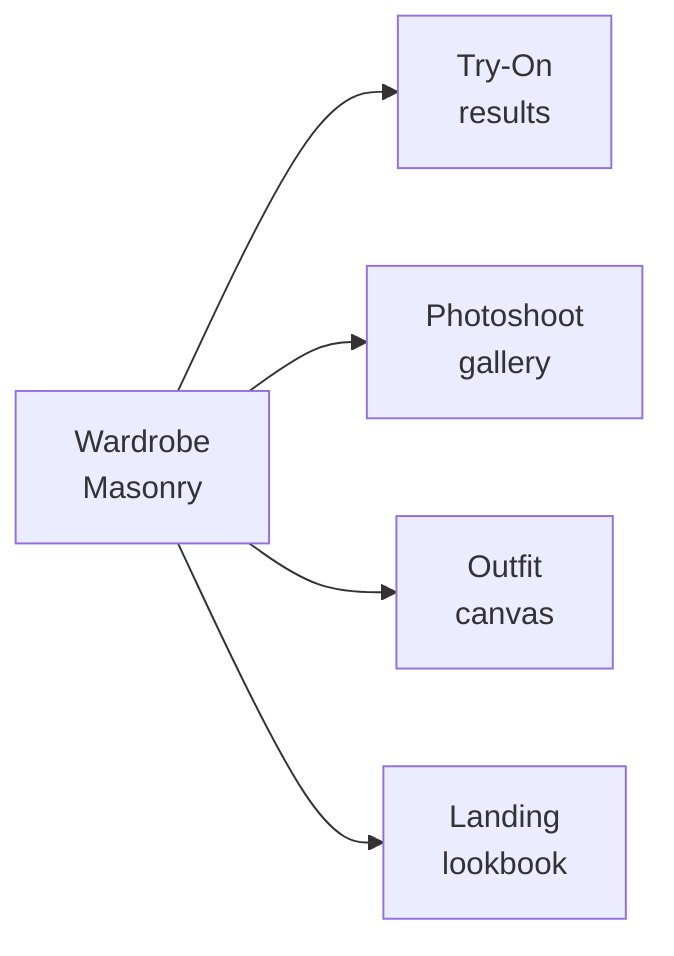

# DESIGN.md — FitCheck AI (Web)

A reusable design reference for AI coding agents working on the FitCheck web app
(React + Vite + Tailwind + shadcn-style primitives in `src/components/ui/`).
Every new page should follow this visual language, not a generic AI/SaaS layout.

Direction: **Wardrobe Studio** — a calm, image-forward "practical wardrobe studio."
Photos and outfit canvases come first; chrome is quiet and recedes. Inspired by
Pinterest (red accent, masonry grid, image-first, flat surfaces) and Airbnb
(soft warm neutrals, rounded UI). This doc is the token source of truth;
`docs/DESIGN.md` holds the product intent and the processing-status vocabulary.

> Stack note: Tailwind tokens are CSS variables in `src/index.css` (shadcn/ui
> convention, HSL channel values). UI primitives live in `src/components/ui/`.
> Extend existing primitives — never invent a second ad-hoc system.

---

## 01 — Color

Pinterest Red carries every primary action. Everything else is monochrome
neutral with a faint warm cast. There is exactly **one** brand accent plus a
single editorial secondary (purple) for AI-pick / recommendation badges.

### Brand & Accent

| Token | Hex | Use |
|-------|-----|-----|
| `--primary` (Brand Red) | `#e00016` → `hsl(354 100% 44%)` | Primary CTA, brand marks, active-tab indicator |

> Brand Red moved from `hsl(354 100% 45%)` (`#e60023`) to `44%` on 2026-07-31. At 45% it
> measured **4.46:1** against `--card`, so `text-primary` on any card panel failed AA by
> 0.04. 44% measures 4.63:1 on card and 5.01:1 on canvas, keeps the 100% saturation this
> section requires, and shifts the hex by one perceptual step. `scripts/check_theme_tokens.py`
> enforces the floor, so this cannot silently regress.

| Brand Red Pressed | `#cc001f` → `hsl(351 100% 43%)` | Pressed state for primary button |
| Editorial Purple | `#7e238b` → `hsl(296 60% 34%)` | "AI pick" / recommendation badges only |

> Migration note: this replaces the legacy indigo `--primary: 238.7 83.5% 66.7%`.

### Surfaces (warm neutral, light)

| Token | Var | Hex | HSL channels | Use |
|-------|-----|-----|--------------|-----|
| Canvas | `--background` | `#ffffff` | `0 0% 100%` | Page background, modals |
| Soft Surface (`surface-soft`) | `--surface-soft` | `#fbfbf9` | `60 20% 98%` | Faintly cream-tinted page wash |
| Surface Card (`surface-card`) | `--card` | `#f6f6f3` | `60 14% 96%` | Pin/item tile background, search-bar fill |
| Secondary BG | `--secondary` | `#e5e5e0` | `60 9% 89%` | Secondary button fill |
| Hairline (`hairline`) | `--border` | `#dbdbd1` | `60 12% 84%` | 1px row dividers, column rules |

There is no dark-CTA-strip surface token. A rare dark strip uses `bg-ink`, whose
label is `text-on-dark` — and both invert, so the strip stays a strip in dark.

### Text

| Token | Var | HSL channels | Hex | vs `--background` | vs `--card` | Use |
|-------|-----|--------------|-----|---|---|-----|
| Ink (`ink`) | `--foreground` | `0 0% 0%` | `#000000` | 21.00 | 19.44 | Headlines, primary nav links |
| Body (`body`) | `--body` | `60 6% 19%` | `#33332e` | 12.64 | 11.70 | Default paragraph text |
| Mute (`mute`) | `--muted-foreground` | `60 3% 37%` | `#61615c` | 6.21 | 5.75 | Metadata, secondary captions, footer links |
| Ash (`ash`) ‡ | `--ash` | `60 3% 43%` | `#71716a` | 4.92 | 4.55 | Disabled text, placeholders |
| Stone | *(hex, light-locked)* | — | `#c8c8c1` | 1.68 | 1.56 | Least-emphasis utility text, disabled borders (never text) |

‡ Ash was `60 3% 56%` (`#92928b`), which measured **3.12:1** on `--background`
and 2.89:1 on `--card` — a straight AA failure on every placeholder and every
disabled label in light mode, and placeholder text is content. `43%` is the
*lightest* value that clears 4.5:1 on both of ash's real backdrops (a focused
input is `--background`; a resting search pill and a disabled button are
`--card`), so it holds the widest Ash/Mute gap the constraint allows: 6
lightness points, 1.26:1 between the two tiers. They are never adjacent on
screen — ash sits inside a control, mute sits in body copy — so the step reads
as a tier rather than a near-miss. Do not lighten past 43%: `46%` reaches only
4.39 / 4.07. Ash on `--secondary` measures 3.91 and is out of contract; a
secondary button's label is `text-secondary-foreground` and a disabled button
repaints to `bg-surface-card`, so that pairing does not occur.

### Semantic

| Token | Var | Hex | Use |
|-------|-----|-----|-----|
| Error (`error`) | `--error` | `#9e0a0a` | Validation messages |
| Error Pale (`error-pale`) | `--error-pale` | `#f9e7e7` | Pale error-pill background |
| Success (`success`, `success-deep`) | `--success` | `#103c23` | In-product success messaging |
| Success Pale (`success-pale`) | `--success-pale` | `#c7f0d7` | Pale success-pill background |
| Editorial Purple (`accent-purple`) | `--accent-purple` | `#84238b` | "AI pick" badge fill; label is always `text-white` |
| Focus Outer | *(hex, light-locked)* | `#435ee5` | 2px outer focus ring (paired with ink inner ring) |

> Every token in these tables except `stone` and `focus-outer` resolves through
> a CSS variable, so it inverts. A fixed hex in `tailwind.config.ts` has no
> `.dark` counterpart in the emitted CSS — that is precisely how dark mode
> broke. Add colors as a `:root` + `.dark` var pair, never as a literal.

### Dark mode

Warm near-black at **hue 60**, never a cool slate or blue-charcoal base. Every
token below is a real `.dark` entry in `src/index.css`; `src/index.css` is the
source of truth and this table is derived from it.

**The three tokens with no separate name.** `hairline`, `ink` and `surface-card`
are not independent colors — they *are* `--border`, `--foreground` and `--card`.
`text-ink` emits `hsl(var(--foreground))`, `border-hairline` emits
`hsl(var(--border))`, `bg-surface-card` emits `hsl(var(--card))`. Do not add a
second variable for any of them.

Surfaces:

| Role | Var | `.dark` HSL | Hex |
|---|---|---|---|
| Canvas | `--background` | `60 5% 10%` | `#1b1b18` |
| Surface card (`surface-card`) | `--card` | `60 5% 13%` | `#23231f` |
| Soft surface (`surface-soft`) | `--surface-soft` | `60 5% 16%` | `#2b2b27` |
| Secondary / raised | `--secondary` | `60 5% 17%` | `#2e2e29` |
| Hairline (`hairline`) | `--border` | `60 5% 22%` | `#3b3b35` |

Text and accent, with measured WCAG ratios against `--background` / `--card` /
`--secondary`:

| Role | Var | `.dark` HSL | Hex | bg | card | secondary |
|---|---|---|---|---|---|---|
| Ink (`ink`) | `--foreground` | `60 20% 98%` | `#fbfbf9` | 16.68 | 15.24 | 13.24 |
| Body (`body`) | `--body` | `60 10% 88%` | `#e3e3dd` | 13.48 | 12.31 | 10.70 |
| Mute (`mute`) | `--muted-foreground` | `60 6% 62%` | `#a4a498` | 6.87 | 6.27 | 5.45 |
| Brand red (`text-primary`) | `--primary` | `354 100% 62%` | `#ff3d51` | 4.98 | 4.54 | 3.95 † |
| Error | `--error` | `0 85% 68%` | `#f36868` | 5.75 | 5.25 | 4.57 |
| Ash (`ash`) ‡ | `--ash` | `60 5% 52%` | `#8b8b7e` | 5.00 | 4.57 | 3.97 |

† `text-primary` never sits on `bg-secondary` (a secondary button carries
`text-secondary-foreground`). Light mode measures 3.83 on the same pair — this
is the brand red's inherent limit, not a dark-mode defect.
‡ Ash is the placeholder / disabled tier only. Its real backdrops are
`--background` (inputs) and `--card` (disabled buttons), both ≥4.5.

Paired fills, where the label sits on its own surface rather than the page:

| Pair | `.dark` | Ratio |
|---|---|---|
| `--primary-foreground` on `--primary` | `#161613` on `#ff3d51` | 5.23 |
| `--success` on `--success-pale` | `#c7f0d7` on `#103c23` | 9.89 |
| `--error` on `--error-pale` | `#f36868` on `#431919` | 5.02 |
| white on `--accent-purple` | `#fff` on `#ad35b6` | 5.30 |
| `on-dark` on `ink` (active filter chip) | `#000` on `#fbfbf9` | 20.25 |

Two inversions look wrong and are deliberate:

- **`--primary-foreground` goes near-black** (`60 6% 8%`). White on the
  lightened red is only 3.5:1; near-black is 5.23:1. Anything that puts a label
  on `bg-accent-purple` must therefore say `text-white` explicitly.
- **`--success` / `--success-pale` swap.** `--success` is the *text* role,
  `--success-pale` the *fill* role. On dark the text goes pale and the fill goes
  deep. Do not "un-invert" them.

**`on-image` is identical in both themes.** `--on-image` / `--on-image-foreground`
are white / black in `:root` *and* `.dark`, because they clothe chrome floating
over a garment photograph (the `pill-on-image` button, the select disc, the
favourite disc, the pin overlay pill). Their backdrop is the image, not the
page. This is what `pill-on-image: bg canvas + text ink` means below: canvas
*white*, not "whatever the page background happens to be".

Keep the red at full saturation so primary actions stay loud against dark.

---

## 02 — Typography

All-sans, like Pinterest. Use **Inter** for UI/body text and **Manrope** for
display tiers, loaded in `src/main.tsx`. No serif. Steep hierarchy: display drops straight to
16px body with no intermediate display tier.

| Role | Size / Weight / lh | Tracking | Use |
|------|---------------------|----------|-----|
| `display-xl` | 70px / 600 / 1.1 | -1.2px | Landing hero, marketing display |
| `display-lg` | 44px / 700 / 1.15 | -1.2px | Section headlines |
| `heading-xl` | 28px / 700 / 1.2 | -1.2px | Page headers |
| `heading-lg` | 22px / 600 / 1.25 | 0 | Section titles |
| `heading-md` | 18px / 600 / 1.3 | 0 | Card title, in-grid label |
| `body-md` | 16px / 400 / 1.4 | 0 | Default body, modal copy |
| `body-strong` | 16px / 600 / 1.4 | 0 | Inline emphasis, nav link |
| `body-sm` | 14px / 400 / 1.4 | 0 | Footer, metadata, helper text |
| `body-sm-strong` | 14px / 700 / 1.4 | 0 | Result-count labels |
| `caption-md` | 12px / 500 / 1.5 | 0 | Captions, link metadata |
| `button-md` | 14px / 700 / 1 | 0 | Primary/secondary buttons |
| `button-sm` | 12px / 700 / 1 | 0 | Compact pill chips |

Display tiers use the `.font-display tracking-tight`
utility (or a `landing-display` class) for the tight tracking.

---

## 03 — Components

Extend the shadcn primitives in `src/components/ui/` along these specs. Do not
duplicate variants — edit the primitive.

### Buttons

| Variant | Spec |
|---------|------|
| `primary` | `bg-primary` (red) + `text on-primary` (white/ink); `rounded-16px`; `h-10` (40px) |
| `primary-pressed` | `bg` Brand Red Pressed |
| `secondary` | `bg secondary-bg` (#e5e5e0) + `text ink`; `rounded-16px` |
| `tertiary` | transparent + `text ink`; `rounded-16px` |
| `pill-on-image` | `bg canvas` + `text ink`; `rounded-full`; sits over photography |
| `icon-circular` | `bg surface-card`; 40px circle; `rounded-full` |
| `disabled` | `bg surface-card` + `text ash` |

Button copy is sentence-case, imperative ("Save outfit", "Add to wardrobe").

### Chips & search

- **FilterChip:** default = `bg surface-card`; active = `bg ink` + `text on-dark`.
  Pills, `rounded-full`, ~36–40px height extending to 44px tappable via padding.
- **PillSearch:** `bg surface-card`, `rounded-full`, `h-12` (48px). Focus = canvas
  bg + 1px ash border, magnifier icon overlay on mobile.

### Cards

- **Item/Pin card:** flat, no shadow, `rounded-16px`, hairline border only on
  focus/hover. 32px radius for large cards and modals.
- **Feature card:** on canvas; soft variant on cream `soft-surface`.
- **Modal card:** centered ~480px desktop, full-width sheet on mobile; the only
  surface that receives elevation (`0 16px 32px rgba(0,0,0,0.16)` over scrim).

### Forms

- **Inputs:** `rounded-16px`, `h-11` (44px), canvas bg, 1px ash border.
- **Focus signal:** double ring — 2px ink inner border + 4px Focus Outer blue
  outline. Never a single colored outline.

### Bottom nav (mobile)

`--bottom-nav-height: 64px` (already a token). Active tab = Brand Red indicator.
Honor `--safe-area-bottom` via `.pb-bottom-nav`.

---

## 04 — Signature: Wardrobe Masonry Grid

The defining layout. A column-based masonry that preserves each garment's
natural aspect ratio — never crops, never forces square tiles. Drives the
Wardrobe browse, Try-On results, Photoshoot gallery, and outfit canvases.

- Tile radius 16px (32px for large/hero tiles)
- Gutters 8px (6px on mobile) so imagery effectively touches across columns
- Columns: 5–6 ultrawide → 4 desktop → 3 → 2 tablet → 1 mobile
- Flat tiles; on hover/focus a hairline + subtle `Save` pill-on-image appears

---

## 05 — Layout & Spacing

8px base with finer 4/6px steps for tight inline gaps. Section rhythm is 64px.

| Name | Value |
|------|-------|
| xxs | 4 |
| xs | 6 |
| sm | 8 |
| md | 12 |
| lg | 16 |
| xl | 24 |
| xxl | 32 |
| section | 64 |

Max content width holds at 1280px even on ultrawide; the masonry expands columns,
not the page width.

---

## 06 — Shapes (Radius)

Three values do all the work. No mid-radius value between md and lg.

| Token | Value | Use |
|-------|-------|-----|
| none | 0 | Footer, primary nav, page sections |
| sm | 8 | Rare editorial tooltip |
| md | 16 | Buttons, inputs, pin/item cards, feature cards |
| lg | 32 | Large pin cards, modals |
| full | 9999 | Search bar, filter chips, overlay pills, avatars |

Set `--radius: 1rem` (16px) in `:root`.

---

## 07 — Depth & Elevation

Content surfaces are **flat**. There is no drop-shadow elevation on cards, grids,
or tiles. The only shadow lives on the modal layer (`0 16px 32px rgba(0,0,0,0.16)`
over a scrim). Hairline borders (1px Hairline token) define edges, not shadows.

---

## 08 — Motion

Subtle state changes only (opacity, hairline appearance, micro-translate). Never
hide primary content behind entrance animations that can strand opacity at 0.
Always honor `prefers-reduced-motion` (the global `@media` reset already exists
in `src/index.css`). Long AI jobs use the processing-status vocabulary below —
honest progress, never fake completion animations.

---

## 09 — Accessibility

- **WCAG AA** contrast on all text (Ink/Body/Mute over canvas; white/ink over red).
- **Every `.dark` foreground must clear 4.5:1 against `--background`, `--card`
  *and* `--secondary`.** All three are real page surfaces, so measuring against
  only the darkest one hides failures. Placeholder/disabled (`ash`) and
  fill-paired labels (`--primary-foreground`, `--success`, `--error`, `on-dark`,
  `on-image-foreground`) are measured against their own fill instead — see the
  dark-mode tables in §01. A token that is byte-identical in `:root` and `.dark`
  is a bug unless it is `--on-image*`.
- **Touch targets:** 44px minimum (`touch-target` utility). Buttons 40px with
  inline padding extend to ~44px tappable.
- **Focus-visible:** the double-ring signal on every interactive element.
- Icon-only actions must have accessible labels.
- Keyboard-reachable controls; never remove focus rings.

---

## 10 — Responsive behavior

Masonry collapses from 5–6 columns down to 1, preserving aspect ratios.

| Name | Width | Key changes |
|------|-------|-------------|
| ultrawide | 1920px+ | Grid 5–6 cols; max-width 1280px |
| desktop-large | 1440px | Default — 4-col grid, full nav |
| desktop | 1280px | Same layout, narrower gutters |
| desktop-small | 1024px | Grid → 3 cols |
| tablet | 768px | Grid → 2 cols; nav → hamburger |
| mobile | 480px | 1-col grid; hero 70px → ~44px |
| mobile-narrow | 320px | Hero → ~36px; section padding 32px |

---

## 11 — Processing-status vocabulary (AI jobs)

Every flow that waits on a backend job aligns its copy to this table. Never
fabricate progress or completion.

| Phase | When | Copy pattern |
|-------|------|--------------|
| Uploading | Client sending image bytes | "Uploading photo…" (+ real byte % if available, else indeterminate) |
| Queued | Backend genuinely queued (batch, photoshoot, social import) | "Queued…" |
| Processing (phase-specific) | Backend reports a real sub-phase via SSE | Backend's own strings: "Extracting items…", "Generating photos…", "3 of 10 processed" |
| Processing (opaque) | Single sync call, no phases (try-on, outfit gen, avatar) | "Processing… (Ns elapsed)" — elapsed only, never fake % |
| Done | Terminal success | Brief confirmation |
| Failed | Terminal failure | Real error message + retry action |

---

## Related

- `docs/DESIGN.md` — product intent + canonical processing-status source.
- `docs/FRONTEND.md`, `docs/references/frontend-components.md` — component map.
- `flutter/DESIGN.md` — mobile parity for the same tokens.
