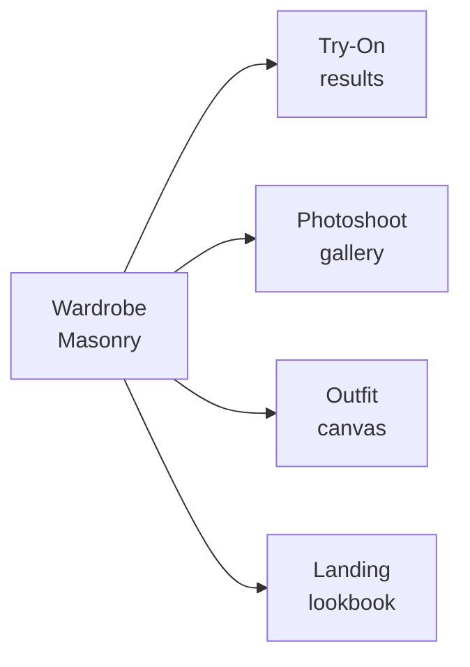

# DESIGN.md — FitCheck AI (Web)

A reusable design reference for AI coding agents working on the FitCheck web app
(React + Vite + Tailwind + shadcn-style primitives in `src/components/ui/`).
Every new page should follow this visual language, not a generic AI/SaaS layout.

Direction: **Wardrobe Studio** — a calm, image-forward "practical wardrobe studio."
Photos and outfit canvases come first; chrome is quiet and recedes. Inspired by
Pinterest (red accent, masonry grid, image-first, flat surfaces) and Airbnb
(soft warm neutrals, rounded UI). This doc is the token source of truth;
`docs/DESIGN.md` holds the product intent and the processing-status vocabulary.

> Stack note: Tailwind tokens are CSS variables in `src/index.css` (shadcn/ui
> convention, HSL channel values). UI primitives live in `src/components/ui/`.
> Extend existing primitives — never invent a second ad-hoc system.

---

## 01 — Color

Pinterest Red carries every primary action. Everything else is monochrome
neutral with a faint warm cast. There is exactly **one** brand accent plus a
single editorial secondary (purple) for AI-pick / recommendation badges.

### Brand & Accent

| Token | Hex | Use |
|-------|-----|-----|
| `--primary` (Brand Red) | `#e60023` → `hsl(354 100% 45%)` | Primary CTA, brand marks, active-tab indicator |
| Brand Red Pressed | `#cc001f` → `hsl(351 100% 43%)` | Pressed state for primary button |
| Editorial Purple | `#7e238b` → `hsl(296 60% 34%)` | "AI pick" / recommendation badges only |

> Migration note: this replaces the legacy indigo `--primary: 238.7 83.5% 66.7%`.

### Surfaces (warm neutral, light)

| Token | Hex | HSL channels | Use |
|-------|-----|--------------|-----|
| Canvas | `#ffffff` | `0 0% 100%` | Page background, cards, modals |
| Soft Surface | `#fbfbf9` | `60 20% 98%` | Faintly cream-tinted page wash |
| Surface Card | `#f6f6f3` | `60 14% 96%` | Pin/item tile background, search-bar fill |
| Secondary BG | `#e5e5e0` | `60 9% 89%` | Secondary button fill |
| Surface Dark | `#262622` | `60 6% 14%` | Warm near-black for rare dark CTA strips |
| Hairline | `#dadad3` | `60 12% 84%` | 1px row dividers, column rules |

### Text

| Token | Hex | Use |
|-------|-----|-----|
| Ink | `#000000` | Headlines, button-on-primary text, primary nav links |
| Ink Soft | `#211922` | Inline-link color in body prose |
| Body | `#33332e` | Default paragraph text |
| Mute | `#62625b` | Metadata, secondary captions, footer links |
| Ash | `#91918c` | Disabled text, placeholders |
| Stone | `#c8c8c1` | Least-emphasis utility text, disabled borders |

### Semantic

| Token | Hex | Use |
|-------|-----|-----|
| Error | `#9e0a0a` | Validation messages |
| Success Deep | `#103c25` | In-product success messaging |
| Success Pale | `#c7f0da` | Pale success-pill background |
| Focus Outer | `#435ee5` | 2px outer focus ring (paired with ink inner ring) |

### Dark mode

Dark surface set is warm near-black, not neutral zinc: background `#1a1a17`,
surface `#232320`, raised `#2c2c28`, hairline `#3a3a35`. Brand red and ink/ash
text inverts to `#fbfbf9` / `#62625b`. Keep red accent at full saturation so
primary actions stay loud against dark.

---

## 02 — Typography

All-sans, like Pinterest. Keep **Plus Jakarta Sans** ("FitCheck Sans"), already
loaded in `src/index.css`. No serif. Steep hierarchy: display drops straight to
16px body with no intermediate display tier.

| Role | Size / Weight / lh | Tracking | Use |
|------|---------------------|----------|-----|
| `display-xl` | 70px / 600 / 1.1 | -1.2px | Landing hero, marketing display |
| `display-lg` | 44px / 700 / 1.15 | -0.8px | Section headlines |
| `heading-xl` | 28px / 700 / 1.2 | -1.2px | Page headers |
| `heading-lg` | 22px / 600 / 1.25 | 0 | Section titles |
| `heading-md` | 18px / 600 / 1.3 | 0 | Card title, in-grid label |
| `body-md` | 16px / 400 / 1.4 | 0 | Default body, modal copy |
| `body-strong` | 16px / 600 / 1.4 | 0 | Inline emphasis, nav link |
| `body-sm` | 14px / 400 / 1.4 | 0 | Footer, metadata, helper text |
| `body-sm-strong` | 14px / 700 / 1.4 | 0 | Result-count labels |
| `caption-md` | 12px / 500 / 1.5 | 0 | Captions, link metadata |
| `button-md` | 14px / 700 / 1 | 0 | Primary/secondary buttons |
| `button-sm` | 12px / 700 / 1 | 0 | Compact pill chips |

Enable Plus Jakarta stylistic sets: `font-feature-settings: 'ss01' on, 'cv11' on`
(already set on `body`). Display tiers use the `.font-display tracking-tight`
utility (or a `landing-display` class) for the tight tracking.

---

## 03 — Components

Extend the shadcn primitives in `src/components/ui/` along these specs. Do not
duplicate variants — edit the primitive.

### Buttons

| Variant | Spec |
|---------|------|
| `primary` | `bg-primary` (red) + `text on-primary` (white/ink); `rounded-16px`; `h-10` (40px) |
| `primary-pressed` | `bg` Brand Red Pressed |
| `secondary` | `bg secondary-bg` (#e5e5e0) + `text ink`; `rounded-16px` |
| `tertiary` | transparent + `text ink`; `rounded-16px` |
| `pill-on-image` | `bg canvas` + `text ink`; `rounded-full`; sits over photography |
| `icon-circular` | `bg surface-card`; 40px circle; `rounded-full` |
| `disabled` | `bg surface-card` + `text ash` |

Button copy is sentence-case, imperative ("Save outfit", "Add to wardrobe").

### Chips & search

- **FilterChip:** default = `bg surface-card`; active = `bg ink` + `text on-dark`.
  Pills, `rounded-full`, ~36–40px height extending to 44px tappable via padding.
- **PillSearch:** `bg surface-card`, `rounded-full`, `h-12` (48px). Focus = canvas
  bg + 1px ash border, magnifier icon overlay on mobile.

### Cards

- **Item/Pin card:** flat, no shadow, `rounded-16px`, hairline border only on
  focus/hover. 32px radius for large cards and modals.
- **Feature card:** on canvas; soft variant on cream `soft-surface`.
- **Modal card:** centered ~480px desktop, full-width sheet on mobile; the only
  surface that receives elevation (`0 16px 32px rgba(0,0,0,0.16)` over scrim).

### Forms

- **Inputs:** `rounded-16px`, `h-11` (44px), canvas bg, 1px ash border.
- **Focus signal:** double ring — 2px ink inner border + 4px Focus Outer blue
  outline. Never a single colored outline.

### Bottom nav (mobile)

`--bottom-nav-height: 64px` (already a token). Active tab = Brand Red indicator.
Honor `--safe-area-bottom` via `.pb-bottom-nav`.

---

## 04 — Signature: Wardrobe Masonry Grid

The defining layout. A column-based masonry that preserves each garment's
natural aspect ratio — never crops, never forces square tiles. Drives the
Wardrobe browse, Try-On results, Photoshoot gallery, and outfit canvases.

- Tile radius 16px (32px for large/hero tiles)
- Gutters 8px (6px on mobile) so imagery effectively touches across columns
- Columns: 5–6 ultrawide → 4 desktop → 3 → 2 tablet → 1 mobile
- Flat tiles; on hover/focus a hairline + subtle `Save` pill-on-image appears

---

## 05 — Layout & Spacing

8px base with finer 4/6px steps for tight inline gaps. Section rhythm is 64px.

| Name | Value |
|------|-------|
| xxs | 4 |
| xs | 6 |
| sm | 8 |
| md | 12 |
| lg | 16 |
| xl | 24 |
| xxl | 32 |
| section | 64 |

Max content width holds at 1280px even on ultrawide; the masonry expands columns,
not the page width.

---

## 06 — Shapes (Radius)

Three values do all the work. No mid-radius value between md and lg.

| Token | Value | Use |
|-------|-------|-----|
| none | 0 | Footer, primary nav, page sections |
| sm | 8 | Rare editorial tooltip |
| md | 16 | Buttons, inputs, pin/item cards, feature cards |
| lg | 32 | Large pin cards, modals |
| full | 9999 | Search bar, filter chips, overlay pills, avatars |

Set `--radius: 1rem` (16px) in `:root`.

---

## 07 — Depth & Elevation

Content surfaces are **flat**. There is no drop-shadow elevation on cards, grids,
or tiles. The only shadow lives on the modal layer (`0 16px 32px rgba(0,0,0,0.16)`
over a scrim). Hairline borders (1px Hairline token) define edges, not shadows.

---

## 08 — Motion

Subtle state changes only (opacity, hairline appearance, micro-translate). Never
hide primary content behind entrance animations that can strand opacity at 0.
Always honor `prefers-reduced-motion` (the global `@media` reset already exists
in `src/index.css`). Long AI jobs use the processing-status vocabulary below —
honest progress, never fake completion animations.

---

## 09 — Accessibility

- **WCAG AA** contrast on all text (Ink/Body/Mute over canvas; white/ink over red).
- **Touch targets:** 44px minimum (`touch-target` utility). Buttons 40px with
  inline padding extend to ~44px tappable.
- **Focus-visible:** the double-ring signal on every interactive element.
- Icon-only actions must have accessible labels.
- Keyboard-reachable controls; never remove focus rings.

---

## 10 — Responsive behavior

Masonry collapses from 5–6 columns down to 1, preserving aspect ratios.

| Name | Width | Key changes |
|------|-------|-------------|
| ultrawide | 1920px+ | Grid 5–6 cols; max-width 1280px |
| desktop-large | 1440px | Default — 4-col grid, full nav |
| desktop | 1280px | Same layout, narrower gutters |
| desktop-small | 1024px | Grid → 3 cols |
| tablet | 768px | Grid → 2 cols; nav → hamburger |
| mobile | 480px | 1-col grid; hero 70px → ~44px |
| mobile-narrow | 320px | Hero → ~36px; section padding 32px |

---

## 11 — Processing-status vocabulary (AI jobs)

Every flow that waits on a backend job aligns its copy to this table. Never
fabricate progress or completion.

| Phase | When | Copy pattern |
|-------|------|--------------|
| Uploading | Client sending image bytes | "Uploading photo…" (+ real byte % if available, else indeterminate) |
| Queued | Backend genuinely queued (batch, photoshoot, social import) | "Queued…" |
| Processing (phase-specific) | Backend reports a real sub-phase via SSE | Backend's own strings: "Extracting items…", "Generating photos…", "3 of 10 processed" |
| Processing (opaque) | Single sync call, no phases (try-on, outfit gen, avatar) | "Processing… (Ns elapsed)" — elapsed only, never fake % |
| Done | Terminal success | Brief confirmation |
| Failed | Terminal failure | Real error message + retry action |

---

## Related

- `docs/DESIGN.md` — product intent + canonical processing-status source.
- `docs/FRONTEND.md`, `docs/references/frontend-components.md` — component map.
- `flutter/DESIGN.md` — mobile parity for the same tokens.
